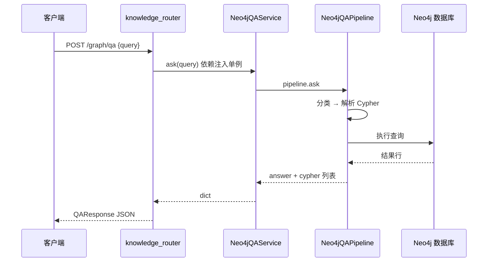

# Neo4j 菜谱图谱与 HTTP 图谱 QA 说明

本文说明 GustoBot 中基于 **Neo4j** 的**菜谱知识图谱**：数据从 JSON 引导入库、图快照 API、以及 **`recipe_kg` 规则化问答流水线**（自然语言 → 意图分类 → Cypher 模板 → 执行 → 文本答案）。HTTP 入口与 Milvus 向量接口挂在同一路由下，但**存储与检索机制完全不同**；与 Milvus 的对比见 [向量知识库.md](向量知识库.md)。

**另一条 Neo4j 用法**：`kg_sub_graph` 里 **Text2Cypher / GraphRAG** 等通过 `langchain_neo4j.Neo4jGraph`（`kg_neo4j_conn.get_neo4j_graph`）连**同一套** `NEO4J_URI` 与库名，但是 **LLM 生成 Cypher** 的 Agent 流程，**不是**本文的 `QuestionClassifier + QuestionParser` 模板链。下文默认「图谱 QA」指 **`Neo4jQAService` + `/graph/qa`**。

### 文档地图（按需跳转）

| 我想… | 建议阅读 |
|--------|----------|
| 区分 Milvus 向量检索与 Neo4j 图谱 | §0.1 |
| 调 HTTP：`GET/POST .../knowledge/graph*` | §2 |
| 分类 → Cypher → 答案整条链 | §3、§3.4 |
| `NEO4J_*` 配置与首次导入 | §4、§8 |
| 一眼区分 recipe_kg / Agent / Text2SQL 工具 / LightRAG | §0.5 |
| 与对话里 Text2Cypher、Text2SQL 工具的关系 | §7、[Text2SQL实现说明.md](Text2SQL实现说明.md) |
| 排错与 FAQ | §9、§10 |

### 文档写给谁？

- 你已经知道项目里有 **Neo4j**，但不清楚 **`/graph` / `/graph/qa` 和对话里的图谱 Agent 是不是一回事**。  
- 你想**从 HTTP 调试到 Cypher、词典、导入 JSON** 有一条清晰的线，而不是散落的文件名。  
- 你愿意看**表、源码引用和少量示意图**；本文在讲清直觉的同时，**不删减**实现级细节（配置键、类名、行为边界）。

若你完全没接触过图数据库，建议先读下面 **「读文档前 60 秒」**，再按 **§0.3** 的顺序往下读。

---

### 读文档前 60 秒：三个词

1. **图数据库（Neo4j）**  
   数据用 **节点（Node）** 和 **关系（Relationship）** 组织，像「知识图谱」：例如一个节点表示菜「宫保鸡丁」，另一个节点表示食材「花生」，中间一条有向边表示「主料关系」并可在边上存「用量」等属性。查询语言叫 **Cypher**（写法接近 ASCII 图：`(:Dish)-[:HAS_MAIN_INGREDIENT]->(:Ingredient)`）。

2. **Cypher**  
   对 Neo4j 声明「找什么模式、返回什么字段」的查询语言。本文的 `/graph/qa` **不是**让大模型自由写 Cypher（那是另一条 Agent 链路），而是：**程序根据问题类型，从模板拼出有限几种 Cypher**，再执行——因此行为**可预期、可单元测试**，但对「没说过的问法」可能直接兜底。

3. **本文件讲的「图谱 QA」**  
   专指 **`Neo4jQAService.ask`** → `Neo4jQAPipeline`：词典与规则分类 → `QuestionParser` 出 Cypher → `AnswerSearcher` 执行并格式化成中文。它与 **Milvus 向量检索**、**Text2Cypher LLM** 是**并列能力**，数据默认来自 **`data/recipe.json` 引导**，与是否给 Milvus 灌库**无自动同步**。

---

## 0. 导读与心智模型

### 0.1 和 Milvus「向量知识库」差在哪里？

| 维度 | Milvus（向量库） | Neo4j（本文） |
|------|------------------|---------------|
| 存什么 | 文本块 + **向量** | **节点、关系、属性**（图） |
| 怎么问 | 语义近似（embedding + 近邻） | 先 **关键词/词典** 归类问题，再拼 **固定 Cypher 模板** |
| 典型 HTTP | `/knowledge/search`、`/knowledge/recipes` | `/knowledge/graph`、`/knowledge/graph/qa` |
| 数据是否同步 | 给 Milvus 灌库 **不会** 自动写 Neo4j | 由 `NEO4J_BOOTSTRAP_JSON` + `data/recipe.json` 等引导 |

**为什么要两套并存？** 工程上常见做法：**向量检索**擅长「说法多变、近似匹配」；**图谱**擅长「结构化关系、精确跳转」（某菜的辅料有哪些、某食材出现在哪些菜里）。本仓库把两种入口都放在 `/knowledge/*` 下，是为了**统一 HTTP 前缀**，不是合并成一种存储。

### 0.2 你可以把 `/graph/qa` 想成「四步流水线」

1. **分类**（`QuestionClassifier`）：用 Aho-Corasick + 词典 + 模糊匹配，从问句里抽菜名、食材、口味等，并打上 `question_type`（如 `recipe_property`、`relationship_query`）。  
2. **解析**（`QuestionParser`）：根据类型生成一条或多条 **Cypher 字符串**（代码里历史原因仍叫 `sql` 列表）。  
3. **执行**（`AnswerSearcher` + `Neo4jDatabase`）：对 Neo4j 执行查询，合并结果行。  
4. **格式化**：拼成自然语言字符串返回；HTTP 再带上 `question_type` 与 `cypher` 列表。

**不是** RAG：不检索文档块、不调用嵌入模型；**也不是** 主对话里那种「LLM 随便写 Cypher」的 Text2Cypher（那是另一条子图）。

**初学者提示**：Aho-Corasick 在这里的作用可以一句话理解为：**在一句话里快速找出词典里出现过的所有菜名、食材名等子串**（比反复 `if "宫保鸡丁" in text` 高效），再结合规则决定问题类型。

### 0.3 建议阅读顺序

1. **§0.4**（下面）建立「请求从哪进、服务何时建连、数据何时导入」的时间线。  
2. **§0.5** 本仓库里 Neo4j 的**多条代码路径**（recipe_kg / kg_sub_graph / Text2SQL 工具 / LightRAG），避免和对话里的 LLM 链路混淆。  
3. **§1** 图数据模型（知道图里有哪些标签/关系，后面读 Cypher 才不懵）。  
4. **§2** HTTP 与 **§4** `Neo4jQAService`（和浏览器 / curl 对上号）。  
5. **§3** 流水线 + **§3.4 走读示例**（把分类→Cypher→答案串起来）。  
6. **§9** 排错与 **§10** FAQ；需要查环境变量时看 **§8** 与 [环境变量与配置说明.md](环境变量与配置说明.md)。

### 0.4 初学者：一次 HTTP 请求在服务端经过什么？

下面只描述 **与 Neo4j 相关的 HTTP 路径**（前缀均为 `{API_V1_PREFIX}/knowledge`，默认 `/api/v1/knowledge`）。



- **`GET /graph`**：不跑问答流水线，而是 **`Neo4jQAService.get_default_graph`**：尽量读**磁盘缓存**；没有缓存或 `refresh=true` 时向 Neo4j 跑 **`NEO4J_DEFAULT_GRAPH_QUERY`**，把图投影转成 JSON。  
- **依赖注入**：`get_neo4j_qa_service` 带 **`@lru_cache`**，因此 **整个进程里通常只有一个 `Neo4jQAService` 实例**（构造时的 bootstrap、driver、流水线只做一次）。这与向量侧的 `KnowledgeService()` 每次请求 new 不同，调试时要知道：**改环境变量后需重启进程**才重建该单例。

### 0.5 Neo4j 在本仓库中的多条代码路径

同一 **Bolt 地址**（`NEO4J_URI`）上可能同时被多条业务使用；**入口与查询方式不同**，排查时请先确认走的是哪条链。

| 路径 | 典型入口 | 查询 / 生成方式 | 延伸阅读 |
|------|----------|-----------------|----------|
| **recipe_kg（本文主线）** | `Neo4jQAService`、`/api/v1/knowledge/graph`、`/graph/qa` | 词典 + **模板 Cypher**，不依赖 LLM 写查询 | 本文 §3 |
| **kg_sub_graph** | `get_neo4j_graph()` → `Neo4jGraph` | **LLM** Text2Cypher、GraphRAG、多工具子图 | [RAG.md](RAG.md)、[workflow工作流.md](workflow工作流.md) |
| **Text2SQL 工具包装** | `text2sql_tool.py` | 自然语言问数实际走 **MySQL**；工具层仍要求 **Neo4j 可连**（历史门禁） | [Text2SQL实现说明.md](Text2SQL实现说明.md) §4.3 |
| **LightRAG（可选）** | 构建与检索管线配置 | 图存储后端可选用 Neo4j（`LIGHTRAG_ENABLE_NEO4J`） | [RAG.md](RAG.md)、[环境变量与配置说明.md](环境变量与配置说明.md) |

**初学者提示**：「对话里用了图谱」不等于「走了 `/graph/qa` 这条 HTTP」；主对话更常见的是 **kg_sub_graph** 里的 LLM 链路。HTTP 上的 **recipe_kg** 更适合做**可复现、可 curl 的**规则问答调试。

---

## 1. 图数据模型（与导入一致）

数据由 `RecipeGraphImporter` 从 **`NEO4J_RECIPE_JSON_PATH`**（默认 `data/recipe.json`）解析写入。核心结构如下（与 `graph_importer_service.py` 中 Cypher 一致）。

### 1.0 初学者：怎么「脑补」这张图？

可以把它想成三类东西叠在一起：

- **菜谱（Dish）** 是中心实体：有整段做法文字、耗时等。  
- **口味、工艺、类型、步骤、食材** 等：有的作为**独立节点**通过关系连到菜（便于回答「这道菜的口味是什么」）；步骤是 **`CookingStep` 节点** 通过 `HAS_STEP` 连到菜。  
- **食材** 上还可以再挂 **营养、功效**（若提供了 `excipients.json`）。

导入时使用 **`MERGE`**：按业务键（如 `Dish.name`）**有则更新、无则创建**，避免重复插入一堆同名菜节点；`NEO4J_BOOTSTRAP_FORCE` 为真时会先 **整图清空** 再导入，详见 **§4**。

### 1.1 节点标签（示意）

| 标签 | 含义 | 典型属性 |
|------|------|----------|
| `Dish` | 菜谱 | `name`、`cook_time`、`instructions` |
| `Ingredient` | 食材 | `name` |
| `Flavor` | 口味 | `name` |
| `CookingMethod` | 工艺 | `name` |
| `DishType` | 类型 | `name` |
| `CookingStep` | 步骤 | `dish_name`、`order`、`instruction` |
| `NutritionProfile` | 营养描述 | `name`、`description` |
| `HealthBenefit` | 食用功效 | `name` |

（`CuisineStyle` 等在解析与查询模板中有设计，具体以 `recipe_json_parser` 与 `query_parser_service` 为准。）

### 1.2 关系类型（示意）

| 关系 | 含义 |
|------|------|
| `HAS_FLAVOR` | 菜 → 口味 |
| `USES_METHOD` | 菜 → 工艺 |
| `BELONGS_TO_TYPE` | 菜 → 类型 |
| `HAS_STEP` | 菜 → 步骤（带 `order`） |
| `HAS_MAIN_INGREDIENT` / `HAS_AUX_INGREDIENT` | 菜 → 食材，边上可有 `amount_text`、`role` |
| `HAS_NUTRITION_PROFILE` | 食材 → 营养 |
| `HAS_HEALTH_BENEFIT` | 食材 → 功效 |

可选 **`NEO4J_INGREDIENT_JSON_PATH`**（默认 `data/excipients.json`）为已出现的食材补充营养与功效节点。

### 1.3 与 `recipe.json` 的对应关系（直觉）

`recipe_json_parser` 把顶层「菜名 → 对象」的 JSON 读成 `RecipeRecord`：包含做法步骤列表、主辅料带用量、口味/工艺/类型列表等。**导入脚本把这些字段拆成「节点 + 关系」**，而不是整段文本扔进一个字段就结束——因此问答流水线可以问「关系型」问题（例如主料是谁、用量多少）。若你的 JSON 字段与解析器预期不一致，可能出现**导入缺边、问答查不到**；深度排查需对照 `recipe_json_parser.py` 与 `graph_importer_service.py`。

---

## 2. HTTP 层（`knowledge_router`）

路由前缀：`/knowledge`，与 `API_V1_PREFIX` 拼接后为 **`/api/v1/knowledge/...`**。

依赖注入：**`get_neo4j_qa_service`** 使用 **`@lru_cache`**，进程内为 **`Neo4jQAService` 单例**（与每次 `new` 的 `KnowledgeService` 不同）。

### 2.1 端点一览

| 方法 | 路径 | 作用 |
|------|------|------|
| GET | `/graph` | 返回默认图投影（节点 + 边），用于前端或调试可视化 |
| POST | `/graph/qa` | 对图谱做自然语言问答（`recipe_kg` 流水线） |

**查询参数 / 请求体**：

- `GET /graph?refresh=false`：`refresh=true` 时**绕过磁盘缓存**，用 `NEO4J_DEFAULT_GRAPH_QUERY` 重新拉 Neo4j 并写回 `NEO4J_GRAPH_CACHE_PATH`。  
- `POST /graph/qa`：`QARequest` 含 `query`（必填）、`include_graph`（是否在响应里附带图）、`refresh_graph`（带图时是否先刷新缓存）。

**响应**（`QAResponse`）：`answer`、`question_type`、`cypher`（字符串列表，实为 Cypher 语句）、可选 `graph`。

### 2.2 响应 JSON 长什么样？（初学者）

下面是一段**结构示例**（字段名以 `knowledge_router.py` 中 `QAResponse` 为准，`cypher` 为列表，每条是本次执行用到的查询字符串；`question_type` 来自分类器，可能为空字符串）：

```json
{
  "answer": "做法: …（格式化后的中文）",
  "question_type": "recipe_property",
  "cypher": [
    "MATCH (n:Dish {name: $name}) RETURN n.instructions AS `做法`"
  ],
  "graph": null
}
```

若 `include_graph: true`，`graph` 会包含 `nodes` 与 `relationships` 数组（供可视化）；体量可能较大，调试时按需打开。

### 2.3 curl 示例

```bash
BASE="http://localhost:8000/api/v1"

# 拉一份图快照（默认可能读本地缓存）
curl -s "${BASE}/knowledge/graph"

# 强制从 Neo4j 重算快照
curl -s "${BASE}/knowledge/graph?refresh=true"

# 图谱问答
curl -s -X POST "${BASE}/knowledge/graph/qa" \
  -H "Content-Type: application/json" \
  -d '{"query":"宫保鸡丁的做法是什么？"}'
```

也可以在浏览器打开 FastAPI 自动文档（若已开启 Swagger）：找到 **`/knowledge/graph/qa`**，直接填 `query` 试跑，便于对照返回的 `question_type` 与 `cypher`。

---

## 3. 问答流水线（`recipe_kg`）

### 3.1 编排入口

```13:30:gustobot/infrastructure/knowledge/recipe_kg/qa_pipeline_orchestrator.py
class Neo4jQAPipeline:
    def __init__(self, database: Neo4jDatabase) -> None:
        self._classifier = QuestionClassifier()
        self._parser = QuestionParser()
        self._searcher = AnswerSearcher(database)

    def ask(self, question: str) -> Dict[str, Any]:
        classification = self._classifier.classify(question)
        parsed = self._parser.parse(
            {"question_type": classification.question_type, "args": classification.args},
        )
        answer = self._searcher.search(parsed)

        return {
            "question_type": classification.question_type,
            "answer": answer,
            "cypher": parsed.get("sql", []),
        }
```

说明：`parsed` 里生成的 Cypher 列表键名为 **`sql`**（历史命名），HTTP 响应字段 **`cypher`** 即该列表。

### 3.2 意图类型（`QuestionClassifier`）

分类依赖包内 **`dicts/*.txt`** 词典（菜名、食材、口味、工艺、类型、耗时、菜系等）与 **Aho-Corasick** 扫描问句，必要时 **`FuzzyMatcher`** 补匹配。常见 `question_type` 包括：

- **`recipe_property`**：指定菜 + 问做法、耗时、口味、工艺、类型、菜系等（映射到节点属性或跳到关联节点）。  
- **`property_constraint`**：没有点名具体菜名，只用口味/工艺等条件**筛选菜名**。  
- **`relationship_constraint`** / **`relationship_query`**：食材与菜之间的主料/辅料关系、用量等。

若问句**无法落入任一规则**，`question_type` 可能为空，解析器不产生 Cypher，最终答案多为 `AnswerSearcher` 中的兜底话术。

**深度提示**：分类是 **关键词 + 词典 + 启发式规则**，不是深度学习模型；因此 **同义说法、OCR 错字、菜名别名** 可能导致识别失败。调优路径通常是：**补 `dicts`、调模糊阈值（`question_intent_classifier` 中 `_fuzzy_threshold`）、或扩展规则**——这已经属于二次开发范畴。

### 3.3 答案与空结果

`AnswerSearcher` 在无结果时返回固定句：**「抱歉，小助手暂时无法回答您的问题。」** 有结果时按 `question_type` 格式化为可读中文（列表字段会拼成「、」分隔）。

### 3.4 走读示例（帮助初学者把三节代码连起来）

下面是一条**典型、且与代码逻辑一致**的推理链（具体 Cypher 以 `query_parser_service.py` 模板为准，参数名以解析器写入的 `parameters` 为准）。

**用户问**：「宫保鸡丁的做法是什么？」

1. **分类**  
   - 词典命中菜名「宫保鸡丁」→ 实体类型含 `Dish`。  
   - 问句里出现「做法」→ 匹配属性关键词 `做法`。  
   - 综合规则 → `question_type = "recipe_property"`，`args` 里带有该菜名及属性列表。

2. **解析**  
   - `QuestionParser` 查 `NODE_PROPERTY_MAP`：`做法` 对应节点属性字段 `instructions`，别名为「做法」。  
   - 生成类似：`MATCH (n:Dish {name: $name}) RETURN n.instructions AS \`做法\``，并设置 `parameters` 如 `{"name": "宫保鸡丁"}`。

3. **执行**  
   - `AnswerSearcher` 对每条 Cypher 调用 `Neo4jDatabase.fetch`；若库中确有该 `Dish` 且 `instructions` 非空，得到一行或多行字典。

4. **格式化**  
   - `recipe_property` 分支把列名与值拼成易读字符串返回；HTTP 包进 `answer`，并把上述 Cypher 字符串放进 **`cypher` 数组**。

若**菜名不在词典**或**图里没有该 `Dish` 节点**，可能在第 1 步就失去类型，或在第 3 步得到空结果 → 第 4 步兜底。**这就是为什么「数据在不在图里」和「问法在不在规则里」要分开排查。**

---

## 4. 服务门面：`Neo4jQAService`

```19:79:gustobot/infrastructure/knowledge/recipe_kg/neo4j_qa_service.py
class Neo4jQAService:
    def __init__(self) -> None:
        driver_kwargs = {}
        if settings.NEO4J_MAX_CONNECTION_LIFETIME:
            driver_kwargs["max_connection_lifetime"] = settings.NEO4J_MAX_CONNECTION_LIFETIME

        self._database = Neo4jDatabase(
            settings.NEO4J_URI,
            settings.NEO4J_USER,
            settings.NEO4J_PASSWORD,
            **driver_kwargs,
        )
        self._cache = GraphCache(Path(settings.NEO4J_GRAPH_CACHE_PATH))
        self._bootstrap_graph()
        self._pipeline = Neo4jQAPipeline(self._database)
        atexit.register(self.close)
```

要点：

- **构造时**若 `NEO4J_BOOTSTRAP_JSON` 为真，会尝试 **`RecipeGraphImporter.bootstrap_from_json`**：图**非空且非 force** 则跳过；**force** 会先 `MATCH (n) DETACH DELETE n` 再全量导入。  
- **`get_default_graph`**：优先读 **磁盘缓存**；无缓存或 `refresh` 时用 **`NEO4J_DEFAULT_GRAPH_QUERY`** 拉子图，再 `convert_graph` 成 JSON 可序列化结构并缓存。  
- **`atexit`** 注册 `close` 关闭 driver。

### 4.1 初学者：第一次启动和第二次启动有什么区别？

可以按下面理解（细节以 `RecipeGraphImporter.bootstrap_from_json` 为准）：

| 场景 | 行为摘要 |
|------|----------|
| `NEO4J_BOOTSTRAP_JSON=false` | 不自动导入；图里有什么完全取决于你事先怎么灌库。 |
| `BOOTSTRAP=true`，图里 **已有** `Dish` 节点，且 **`NEO4J_BOOTSTRAP_FORCE=false`** | **跳过导入**（日志里会有 "already populated" 类信息），避免每次启动重复写。 |
| `BOOTSTRAP=true`，图 **为空** | 从 `NEO4J_RECIPE_JSON_PATH` 导入；成功后会 **invalidate 图快照缓存**。 |
| `NEO4J_BOOTSTRAP_FORCE=true` | **删除图中全部节点与关系** 后重新导入——生产环境慎用。 |

因此：**改 `recipe.json` 后若图非空，默认不会自动重导**；需要 `FORCE`、手动清库、或自行执行导入逻辑。

---

## 5. 数据库客户端：`Neo4jDatabase`

`gustobot/infrastructure/knowledge/recipe_kg/graph_database_client.py` 对官方 **`neo4j` Driver** 做薄封装：

- **`execute`**：执行写查询（如导入时的 `UNWIND ... MERGE`），不返回行。  
- **`fetch`**：读查询，每行变成一个 **Python 字典**（列名 → 值），供 `AnswerSearcher` 消费。  
- **`fetch_graph`**：返回 **Neo4j 的 `Graph` 投影**（含节点与关系对象），再经 `graph_cache_loader.convert_graph` 转成可 JSON 序列化的 `nodes` / `relationships`。

**初学者**：可以把 `fetch` 理解成「跑一条 SQL 的 SELECT，但语言是 Cypher」；`execute` 则是「跑 DDL/DML 式的写入」。实际语法与事务语义仍以 Neo4j 文档为准。

---

## 6. 图快照缓存

- **路径**：`NEO4J_GRAPH_CACHE_PATH`（默认 `data/neo4j/graph.json`）。  
- **作用**：减轻 `GET /graph` 对 Neo4j 的重复压力；**引导导入成功**后会 **`invalidate()`** 删缓存，避免旧快照。  
- **注意**：默认图查询带 **`LIMIT 100`**，快照**不是全图**，仅适合概览或演示。

**常见误解**：「`/graph` 里只有一百来个节点，是不是导入失败了？」——不一定，可能只是 **查询上限**；要在 Neo4j Browser 或其它客户端跑 `MATCH (n) RETURN count(n)` 看真实规模。

---

## 7. 与 `kg_sub_graph` 共用数据库

`gustobot/application/agents/kg_sub_graph/kg_neo4j_conn.py` 中 **`get_neo4j_graph()`** 同样使用 **`settings.NEO4J_URI`、`NEO4J_USER`、`NEO4J_PASSWORD`、`NEO4J_DATABASE`** 构造 **`Neo4jGraph`**，供 Text2Cypher、多工具工作流等使用。

因此：**同一 Neo4j 实例**上可能同时存在「模板化 `recipe_kg` 问答」与「LLM 生成 Cypher 的 Agent」两类客户端；排查问题时确认**连的是同一 URI**，但**调用的代码路径不同**。

**多数据库名（进阶）**：`kg_neo4j_conn.get_neo4j_graph()` 使用 **`settings.NEO4J_DATABASE`** 指定逻辑库。`recipe_kg` 使用的 **`Neo4jDatabase`**（`graph_database_client.py`）当前对 driver 取 **默认 session**，未显式传入 `NEO4J_DATABASE`。在 Neo4j 4+ 多库场景下，若你把 **`NEO4J_DATABASE` 配成非默认库**，可能出现 **Agent 看到的数据**与 **`/graph/qa` 读写的数据**不一致。生产环境建议：**统一使用默认库 `neo4j`**，或后续在 `Neo4jDatabase` 中显式对齐 `NEO4J_DATABASE`（以源码为准）。

更全的 RAG / 子图关系见 [RAG.md](RAG.md)、[workflow工作流.md](workflow工作流.md)。主对话路由与 `graphrag-query` 等见 [智能体路由速查.md](智能体路由速查.md)。

---

## 8. 配置项（`settings.py`）

具体释义与部署示例仍以 **[环境变量与配置说明.md](环境变量与配置说明.md)** 为准；本节列出与 **本文链路** 强相关的键：

| 变量 | 含义（摘要） |
|------|----------------|
| `NEO4J_URI` | Bolt 地址，默认 `bolt://neo4j:7687`（Docker 场景常见） |
| `NEO4J_USER` / `NEO4J_PASSWORD` | 认证；均可为空时走无认证（视服务端配置） |
| `NEO4J_DATABASE` | 逻辑库名，默认 `neo4j`；**`get_neo4j_graph()` / LangChain** 使用；`recipe_kg` 的 `Neo4jDatabase` 与多库行为见 **§7** |
| `NEO4J_DEFAULT_GRAPH_QUERY` | 图快照用的 Cypher，默认 `MATCH (a)-[r]-(b) RETURN a, r, b LIMIT 100` |
| `NEO4J_GRAPH_CACHE_PATH` | 快照 JSON 路径 |
| `NEO4J_MAX_CONNECTION_LIFETIME` | 可选，传入 driver |
| `NEO4J_BOOTSTRAP_JSON` | 为真时构造 `Neo4jQAService` 会尝试从 JSON 引导 |
| `NEO4J_BOOTSTRAP_FORCE` | 为真时强制清空图并重导 |
| `NEO4J_RECIPE_JSON_PATH` | 菜谱 JSON，默认 `data/recipe.json` |
| `NEO4J_INGREDIENT_JSON_PATH` | 辅料/营养 JSON，默认 `data/excipients.json`，可 `None` |

别名：`NEO4J_USERNAME` 属性等价于 `NEO4J_USER`（兼容旧环境变量名）。

---

## 9. 注意事项与排错

### 9.1 数据与问答效果

- **词典驱动**：分类质量强依赖 **`recipe_kg/dicts/`** 与问句用词；菜名不在词典里时，可能识别不到 `Dish`，导致**无法生成 Cypher**。扩展词典或改进匹配是主要调优手段之一。  
- **JSON 与图一致**：`/graph/qa` 只查 **Neo4j**；若只更新了 Milvus 向量库或只改了业务 DB，**图里没变**则答案不变。  
- **引导失败**：`recipe.json` 缺失、解析失败或 Neo4j 不可达时，构造服务可能打 error 日志；图可能为空，问答与快照均无意义。

### 9.2 运维

- **`NEO4J_BOOTSTRAP_FORCE=true`** 会 **删全图** 再导入，生产环境慎用。  
- 快照 **LIMIT** 导致「图 API 里看不到全部节点」是预期行为，不代表库里只有这么多数据。  
- 若 HTTP 500：先查 Neo4j 进程与 `NEO4J_URI`、防火墙、认证；再看应用日志中 `Neo4j` / `recipe_kg` 相关异常。

### 9.3 自查清单

| 现象 | 建议检查 |
|------|----------|
| `/graph/qa` 总兜底 | 问句是否匹配意图；`question_type` 是否为空；词典是否覆盖菜名/食材 |
| `/graph` 为空 | 是否成功 bootstrap；`GET /graph?refresh=true`；库是否真无数据 |
| Agent 里 Neo4j 正常但 `/graph/qa` 异常 | 是否同一 URI；或一侧未导入 `data/recipe.json` |
| 改 JSON 后图没变 | `NEO4J_BOOTSTRAP_FORCE` 或手动清库后重启；或图已有数据时默认跳过导入 |
| Bolt 连接失败 / `ServiceUnavailable` | Neo4j 容器是否运行；`NEO4J_URI` 是否可从应用进程解析（Docker 网络与宿主机端口） |
| 认证失败 | `NEO4J_USER` / `NEO4J_PASSWORD` 与 Neo4j 配置一致；别名 `NEO4J_USERNAME` 是否与 `settings` 映射一致 |
| 改 `.env` 后行为不变 | `Neo4jQAService` 为 **`@lru_cache` 单例**，需**重启后端进程** |
| Agent 有数据、HTTP 问答无数据 | 是否 **多库名** 导致（见 §7 多数据库名说明） |

---

### 9.4 与 Text2SQL 的混淆点

**Text2SQL** 执行的是 **MySQL** 上的只读 SQL，但 **`text2sql_tool`** 在跑工作流前仍要 **`get_neo4j_graph()` 成功**。因此会出现「问的是表统计，报错却是图数据库连不上」——这是工具层门禁，不是 Schema 还在 Neo4j。详见 [Text2SQL实现说明.md](Text2SQL实现说明.md)。

---

## 10. 初学者常见问题（FAQ）

**Q：`/graph/qa` 和对话里选的「图谱」技能是同一个东西吗？**  
不一定。对话可能走 **Text2Cypher 多工具子图**（LLM 写 Cypher），而本文描述的是 **HTTP 上的模板流水线**。它们可能连**同一 Neo4j**，但**代码入口、失败表现、可调试字段**都不同；对比见 **§7** 与 [RAG.md](RAG.md)。

**Q：为什么返回的字段叫 `cypher`，代码里却是 `sql`？**  
历史命名：`QuestionParser` 内部列表变量名为 `sql_statements`，但实际字符串内容是 **Cypher**。`Neo4jQAPipeline` 返回时把该列表映射为 HTTP 的 **`cypher`** 字段。

**Q：我增加了新菜到 `recipe.json`，为什么问答还是旧数据？**  
默认 bootstrap 在图**非空**时会**跳过导入**。需要 **`NEO4J_BOOTSTRAP_FORCE=true` 后重启**（注意会清空全图），或在 Neo4j 侧自行导入，并 **删掉图快照缓存文件** 以免 `/graph` 仍显示旧投影。

**Q：`question_type` 为空是什么意思？**  
分类器没有把你的问句匹配到任一规则；后续解析器通常**不会生成可执行 Cypher**，执行阶段无结果 → 兜底回答。应检查词典、问法是否覆盖。

**Q：能和 Milvus 混查吗？**  
HTTP 层当前是**分开的接口**；业务上要「先图后向量」需在应用层编排。参见 [向量知识库.md](向量知识库.md) 与 [RAG.md](RAG.md) 中的多工具说明。

---

## 11. 相关文件一览

| 路径 | 职责 |
|------|------|
| `gustobot/interfaces/http/knowledge_router.py` | `GET /graph`、`POST /graph/qa` |
| `gustobot/infrastructure/knowledge/recipe_kg/neo4j_qa_service.py` | 门面：连接、bootstrap、缓存、流水线 |
| `gustobot/infrastructure/knowledge/recipe_kg/graph_database_client.py` | Driver 封装 |
| `gustobot/infrastructure/knowledge/recipe_kg/graph_importer_service.py` | JSON → 图 |
| `gustobot/infrastructure/knowledge/recipe_kg/recipe_json_parser.py` | `recipe.json` / `excipients.json` 解析 |
| `gustobot/infrastructure/knowledge/recipe_kg/qa_pipeline_orchestrator.py` | 流水线组装 |
| `gustobot/infrastructure/knowledge/recipe_kg/question_intent_classifier.py` | 意图与实体 |
| `gustobot/infrastructure/knowledge/recipe_kg/query_parser_service.py` | Cypher 模板生成 |
| `gustobot/infrastructure/knowledge/recipe_kg/answer_search_engine.py` | 执行与格式化 |
| `gustobot/infrastructure/knowledge/recipe_kg/graph_cache_loader.py` | 快照 JSON 缓存 |
| `gustobot/infrastructure/knowledge/recipe_kg/dicts/*.txt` | 分类词典 |
| `gustobot/application/agents/kg_sub_graph/kg_neo4j_conn.py` | LangChain `Neo4jGraph` 连接（子图用） |

---

## 12. 延伸阅读

- [向量知识库.md](向量知识库.md) — Milvus 与 Neo4j 同路由不同库的对照  
- [RAG.md](RAG.md) — 图谱 Agentic RAG、Text2Cypher、LightRAG 等与本文 HTTP QA 的关系  
- [Text2SQL实现说明.md](Text2SQL实现说明.md) — MySQL 问数与 Neo4j 工具门禁  
- [智能体路由速查.md](智能体路由速查.md) — `graphrag-query`、主图如何进入子图  
- [提示词工程.md](提示词工程.md) — 多智能体与工具侧提示词组织（LLM 写 Cypher 等）  
- [agent项目架构说明.md](agent项目架构说明.md) — 包结构与模块索引  
- [环境变量与配置说明.md](环境变量与配置说明.md) — `NEO4J_*` 逐项说明  

*若接口、Schema 或实现与当前分支不一致，以仓库源码为准，并同步更新本文（尤其 §0.5、§7、§9）。*
