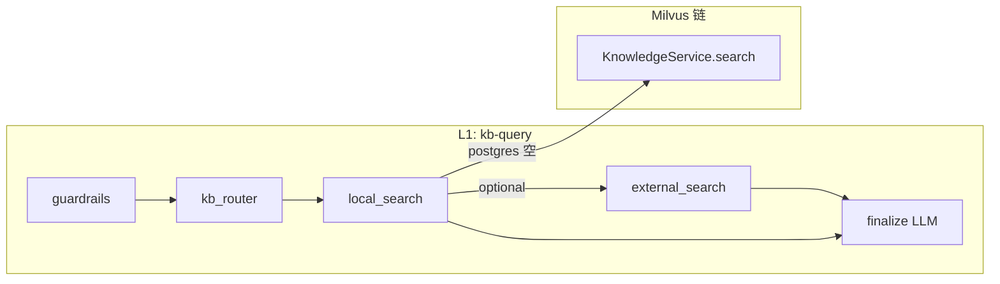

# 项目中的 RAG（检索增强生成）说明

本文从**工程视角**归纳 GustoBot 里所有「先检索、再生成」或「检索辅助生成」的路径：**Milvus 向量库、KB 多工具子图（pgvector + Milvus + 外搜）、图谱 Agentic RAG（Few-shot + Text2Cypher）、LightRAG** 等。实现以当前仓库源码为准。

**初学者建议**：先读 **§0～1** 建立「有几条 RAG、各自检索什么」；再读 **§7 数据流简图**；排查问题时用 **§8 自查表** + **§0.5**。Milvus 入库与 HTTP 细节见 [向量知识库.md](向量知识库.md)；Neo4j 模板化图 QA 见 [Neo4j库.md](Neo4j库.md)；路由与提示见 [智能体路由速查.md](智能体路由速查.md)、[提示词工程.md](提示词工程.md)。

**权威源码（按链路）**：

| 链路 | 主要代码位置 |
|------|----------------|
| Milvus 检索 + 主图 KB 节点 | `gustobot/infrastructure/knowledge/knowledge_service.py`、`vector_store.py`、`reranker.py`、`kb_tools/node.py` |
| KB 多工具（L1 `kb-query`） | `kg_sub_graph/agentic_rag_agents/workflows/multi_agent/multi_tool.py`（`create_kb_multi_tool_workflow`） |
| 图谱 Text2Cypher Few-shot | `retrievers/cypher_examples/`（`recipe_retriever.py`、`neo4j_vector_example_retriever.py` 等）、`components/text2cypher/generation/node.py` |
| 预定义 Cypher 匹配（TF-IDF） | `components/predefined_cypher/utils.py`（`VectorQueryMatcher`） |
| 图谱多工具编排 | 同上目录 `multi_tool.py`（`create_multi_tool_workflow`）；节点与边见 [workflow工作流.md](workflow工作流.md) |
| Text2SQL（Schema 检索 + SQL） | `application/agents/text2sql/workflow.py` 及各 `components/` 节点；经多工具中 `text2sql_query` 嵌入 |
| LightRAG | `application/services/lightrag_service.py`、`interfaces/http/lightrag_router.py`、`components/customer_tools/node.py` |
| 外搜增强（可选） | `application/prompts/search_prompts.py`、`infrastructure/tools/search.py`、`kb_tools/node.py`（`KB_ENABLE_EXTERNAL_SEARCH`） |
| 向量库 / 图 QA HTTP | `interfaces/http/knowledge_router.py`（`/knowledge/*`） |
| Redis 语义缓存（可选组件） | `application/services/redis_cache.py`（`RedisSemanticCache`；主聊天路径未必挂载，见 [agent开发项目总览.md](agent开发项目总览.md)） |

---

## 0. 初学者导读：RAG 在本项目里指什么？

**经典 RAG** 常指：把用户问题编成向量 → 在向量库里找相近文本块 → 把块当作 **上下文** 再让 LLM 生成答案。本项目的 **Milvus 菜谱库 + `kb_tools` 节点** 就是这一形态。

但仓库里还有几类**广义 RAG**：

1. **多源检索再生成**：KB 子图按路由先查 **PostgreSQL（pgvector）**，无结果再 **Milvus**，还可接 **外搜**，最后拼 context 生成（仍在 `multi_tool.py` 内）。  
2. **检索的是「示例 query–Cypher」而非用户文档**：Text2Cypher 用 **retriever** 拉 Few-shot，再生成 Cypher，执行 Neo4j 后把**查询结果**当证据做汇总——这是 **Agentic RAG / Tool RAG** 常见形态。  
3. **LightRAG**：在本地索引上做 **向量 + 图结构** 混合检索，再交给 LLM 组织答案（独立 HTTP 与 `customer_tools` 工具节点）。

**注意**：**Neo4j 图自然语言问答**（`POST /api/v1/knowledge/graph/qa`，`Neo4jQAService`）走的是 **图上的意图与 Cypher 模板/规则**，返回 `answer`、`question_type`、`cypher` 等；**不是** Milvus 文档块 RAG，也与 LightRAG 索引无关。下文 **第 2.7 节**单独说明。

### 0.5 初学者：怎样用本文排查「检索不到 / 答不对」？

1. **先对齐入口**：用户说的是 **主聊天**，还是你手动调的 **`/knowledge/search`**、**`/lightrag/query`**？同一句问题在不同入口可能走 **完全不同的链**（见 **§1、§6**）。  
2. **再对齐数据**：向量是否在 **Milvus**、文化长文是否在 **KB 子图的 postgres/Milvus**、图数据是否在 **Neo4j**、另一套索引是否在 **LightRAG 目录**——**互相不会自动同步**（见 **§0.6**）。  
3. **最后对齐阈值与护栏**：Milvus 路径上的 **`KB_SIMILARITY_THRESHOLD`、rerank、`filter_expr`**；KB 子图上的 **路由 `tools`、postgres 是否抢先返回**；图谱上的 **Few-shot / Schema**。细节分别见 [向量知识库.md](向量知识库.md) §12、[提示词工程.md](提示词工程.md)。

### 0.6 数据与索引：各条链是否「共用一套库」？

**不是。** 可以把它理解成多张**并行**的「知识台面」，入库路径不同，默认**不会**彼此自动同步：

| 台面 | 典型数据形态 | 常见写入方式 |
|------|----------------|----------------|
| **Milvus** `recipes` 等 | 文本块 + 向量 + 标量元数据 | HTTP `/knowledge/recipes`、`import_recipes.py`、`KnowledgeService.add_*` |
| **KB 子图 postgres** | 经摄取服务写入的表格/pgvector（以部署为准） | 摄取流水线、`INGEST_SERVICE_URL` |
| **Neo4j 菜谱图** | 实体、关系（`Dish`、`Ingredient`…） | `NEO4J_BOOTSTRAP_JSON` + `data/recipe.json` 等，见 [Neo4j库.md](Neo4j库.md) |
| **LightRAG 工作目录** | 块/实体/关系向量与图文件 | 构建期脚本、`/lightrag/insert` |

因此：**只给 Milvus 灌了菜谱全文，不等于 Neo4j 里就有图；也不等于 LightRAG 目录里已有索引。** 讨论「为什么检索不到」时，必须先问：**你期望命中的那份数据，当初写进的是哪条链？**

---

## 1. RAG 形态总览（对照表）

| 名称 | 检索对象 | 生成阶段典型行为 | 典型入口（用户侧） |
|------|----------|------------------|-------------------|
| **Milvus 向量 RAG** | Milvus 中菜谱/文档块向量 | `KnowledgeService.search` → 片段进 prompt → LLM 作答 | L1 `kb-query` 经主图 KB 子图；或 `file-query` 上传后同节点；HTTP `/knowledge/search` |
| **KB 多工具 RAG** | 先 pgvector（经摄取服务），再 Milvus；可选外搜 | `multi_tool.py` 内拼 `postgres_context` / `milvus_context` → `final_prompt` | L1 `kb-query` → `create_kb_multi_tool_workflow` |
| **图谱 Agentic RAG** | Few-shot Cypher 示例 + Neo4j Schema；执行结果行 | 多节点：生成 Cypher → 校验/执行 → summarize / final_answer | L1 `graphrag-query` / `text2sql-query` → `create_research_plan` → 多工具子图 |
| **LightRAG** | 本地 `LIGHTRAG_WORKING_DIR` 下图与向量 | `LightRAG.aquery` 等 | HTTP `/api/v1/lightrag/*`；工具 `microsoft_graphrag_query`（实现为 LightRAG） |
| **外搜增强** | 互联网摘要（SearchTool） | 与 Milvus 命中一并写入 system 上下文 | `KB_ENABLE_EXTERNAL_SEARCH` 时 `kb_tools` |

### 1.1 一句话选对文档

| 你想搞懂… | 优先读 |
|-----------|--------|
| Milvus 切块、嵌入、重排、HTTP `/knowledge/search` | [向量知识库.md](向量知识库.md) |
| L1 为啥进了 `kb-query` / `graphrag`、提示词与护栏 | [提示词工程.md](提示词工程.md)、[智能体路由速查.md](智能体路由速查.md) |
| Neo4j HTTP `/graph/qa`、与 Milvus 区别 | [Neo4j库.md](Neo4j库.md) |
| 主图节点、子图边、`Send`/`Command` | [workflow工作流.md](workflow工作流.md) |
| LightRAG HTTP、索引目录、模式 | 本文 **§10** |

---

## 2. Milvus 向量 RAG（菜谱知识库）

### 2.1 流程（一句话）

**入库**：HTTP 或脚本 → `KnowledgeService` → 切块、Embedding、写入 Milvus（详见 [向量知识库.md](向量知识库.md)）。  
**检索生成**：`KnowledgeService.search`（可选 rerank）→ `build_knowledge_system_prompt(context)` → LLM `chat`。

### 2.2 主图 KB 节点与检索调用

`create_knowledge_query_node` 内直接调用同一套 `KnowledgeService.search`，再把检索结果拼进系统提示（并可叠加外搜）：

```106:113:gustobot/application/agents/kb_tools/node.py
        try:
            documents = await knowledge_service.search(
                query=question,
                top_k=top_k,
                similarity_threshold=similarity_threshold,
                filter_expr=filter_expr,
            )
            logger.info("Knowledge search retrieved {} documents.", len(documents))
```

提示词模板见 `gustobot/application/agents/kb_tools/prompts.py`（「只依据参考文档、勿编造」等约束）。

### 2.3 与「KB 多工具子图」的关系

- **主图 `kb-query`** 默认走 **`create_kb_multi_tool_workflow`**（历史文化向、postgres 优先 + Milvus 兜底），**不是**直接等价于「仅 `kb_tools`」。  
- **`kb_tools` 节点**也会在 **`file-query`** 等路径被调用（上传文本入库后立即问答）。  
具体以 `lg_builder.py` 中 `create_kb_query` 编译的子图为准。

### 2.4 `KnowledgeService.search` 检索流水线（细）

与 [向量知识库.md](向量知识库.md) 一致，这里只强调 **RAG 侧可见行为**：

1. **查询嵌入**：`embedder.embed_query(query)`（与入库同一套模型时效果最稳）。  
2. **向量召回**：`vector_store.search(embedding, recall_k, filter_expr)`；若启用 **Reranker**，`recall_k` 会抬到 `settings.RERANK_MAX_CANDIDATES`，再精排后截断到 `top_k`。  
3. **相似度阈值**：`filter_by_similarity` 与是否启用 reranker **组合**时，阈值应用在流水线不同阶段（见方法内分支）；调参时若「库里有但永远空」，优先对照 `KB_SIMILARITY_THRESHOLD` 与 rerank 阈值。  
4. **返回**：列表元素含 `content`/`score`（及可选 `rerank_score`、`metadata` 等），供下游拼 prompt。

```224:280:gustobot/infrastructure/knowledge/knowledge_service.py
    async def search(
        self,
        query: str,
        *,
        top_k: Optional[int] = None,
        similarity_threshold: Optional[float] = None,
        filter_expr: Optional[str] = None,
        filter_by_similarity: bool = True,
    ) -> List[Dict[str, Any]]:
        """对查询文本做向量检索，并按配置过滤、可选重排。
        ...
        """
        if not query or not query.strip():
            return []

        top_k = top_k or settings.KB_TOP_K
        similarity_threshold = (
            similarity_threshold if similarity_threshold is not None else settings.KB_SIMILARITY_THRESHOLD
        )

        # 如果启用 reranker，先召回更多候选文档
        recall_k = top_k
        if self.reranker.enabled:
            recall_k = settings.RERANK_MAX_CANDIDATES  # 召回更多文档用于重排

        embedding = await asyncio.to_thread(self.embedder.embed_query, query)
        results = await asyncio.to_thread(
            self.vector_store.search,
            embedding,
            recall_k,  # 使用更大的召回数量
            filter_expr,
        )

        candidates = results
        if filter_by_similarity and similarity_threshold is not None:
            candidates = [r for r in candidates if r.get("score", 0.0) >= similarity_threshold]

        # 使用 reranker 精排
        if candidates and self.reranker.enabled:
            candidates = await self.reranker.rerank(query, candidates, top_k)
```

### 2.5 `kb_tools`：上下文拼装、置信度与失败路径

- **上下文**：`_build_context_snippet` 取命中条目的 `content`/`document` 拼成「文档 1/2/…」块，再经 `build_knowledge_system_prompt` 注入系统提示（见 `kb_tools/prompts.py`）。  
- **外搜**：`KB_ENABLE_EXTERNAL_SEARCH` 时，`SearchTool.search` 结果再拼入上下文（与向量命中并列）。  
- **降级**：检索异常 → `FALLBACK_MESSAGE` + `metadata.reason=search_failure`；无文档 → `no_documents`。  
- **来源**：`_collect_sources` 从 `metadata` / `source` / `url` / `id` 收集，写入响应 `sources`。

### 2.6 HTTP：仅 Milvus 检索（无主图、无合成答）

`knowledge_router` 下 **`POST /api/v1/knowledge/search`** 直接调用 `KnowledgeService.search`，返回结构化 `results` 列表，**不经过** LangGraph、**不调用** 合成回答 LLM。适合联调向量库或与摄取服务对照。

批量入库、统计、清空等见同路由前缀 **`/api/v1/knowledge/recipes`**、`/stats`、`/clear` 等（以 `knowledge_router.py` 为准）。

### 2.7 Neo4j 图 QA API（与向量 RAG 并列的另一条路）

| 项目 | 说明 |
|------|------|
| 路径 | `POST /api/v1/knowledge/graph/qa`，请求体 `QARequest`（`query`、`include_graph`、`refresh_graph`） |
| 实现 | `get_neo4j_qa_service()` → `Neo4jQAService.ask`（`gustobot/infrastructure/knowledge/recipe_kg`） |
| 与 RAG 文档的关系 | 属于 **图数据上的问答**（词典 + Cypher 模板流水线），**不是** Milvus 文档块 RAG，也**不是**主图里 Text2Cypher 多工具那条 Agent 链；调试「图能答、向量答不了」时要区分入口。 |

与 **图谱多工具里的 Text2Cypher**（§4）对比：两者都可能查 Neo4j，但 **HTTP `/graph/qa`** 是 **规则化 `recipe_kg` 管道**；**`graphrag-query` → `create_research_plan`** 是 **LLM + Few-shot + 校验执行** 的 Agentic 流程。详见 [Neo4j库.md](Neo4j库.md) 与 [提示词工程.md](提示词工程.md)。

---

## 3. KB 多工具子图（`create_kb_multi_tool_workflow`）

**位置**：`gustobot/application/agents/kg_sub_graph/agentic_rag_agents/workflows/multi_agent/multi_tool.py`。

### 3.1 在 RAG 中的角色

用户经 L1 进入 **`kb-query`** 后，子图内顺序大致为：**护栏** → **检索路由器（LLM 结构化输出 `KBRouteDecision`）** → 按决策调用 **postgres / milvus / 外搜** → **final_prompt** 基于拼接上下文生成回答。

### 3.2 PostgreSQL 与 Milvus 的优先级（产品规则）

内联 `router_prompt` 明确：**postgres（pgvector）为第一优先级**（结构化/表格类），**有结果则不再查 Milvus**；Milvus 作为**长文本、典故叙事**等兜底。默认工具列表常为 `['postgres', 'milvus']`，由路由节点解析后执行。

### 3.3 外搜与摄取服务

- 外搜 URL、超时等与 `settings` 及构造函数参数相关；路由可给出 `external` / `hybrid`。  
- PostgreSQL 检索通常通过 **摄取服务 HTTP**（`postgres_search_url`）完成，需与 `kb_ingest` 或仓库文档中的部署方式一致。

### 3.4 初学者注意

- 若 Milvus 有数据但 KB 子图总走「空」：可能是 **postgres 先返回了空结构**或路由 `tools` 未包含 `milvus`；需看日志与 `KBRouteDecision`。  
- 该子图提示词**内联在 `multi_tool.py`**，与 `lg_prompts.py` 分离，修改时全文搜索字符串。

### 3.5 摄取服务 URL 与「外搜同源」去重

- **PostgreSQL/pgvector 检索**并非直连本进程内的 DB，而是由 **`INGEST_SERVICE_URL`** 拼出  
  **`{INGEST_SERVICE_URL}/api/v1/knowledge/search`**，对摄取服务发 **POST**（body 含 `query`、`top_k`，可选 `threshold`）。未配置 `INGEST_SERVICE_URL` 时，日志会提示跳过 postgres，**直接走 Milvus**。  
- **`KB_EXTERNAL_SEARCH_URL`** 与上述 postgres URL **相同时**，`external_is_postgres` 为真，`external_search` 会跳过，避免对同一端点重复 POST（见 `multi_tool.py` 中 `external_search` 开头判断）。

### 3.6 `local_search` 与 `finalize` 的关键分支

- **postgres 有命中**：不再查 Milvus；`local_results` 以 postgres 为主。  
- **postgres 无命中或未选**：`knowledge_service.search` 走 Milvus，结果打标 `tool=milvus`。  
- **本地全空且 route 为 local/hybrid**：若允许外搜且配置了 URL，会把 `route` 改为 `external`，下一跳走 `external_search`。  
- **finalize**：护栏 `end` 时直接返回 `summary`；否则拼接 `milvus_context` / `postgres_context` / `external_context` 调 LLM；若 **本地与外源均无结果**，返回固定兜底话术（「暂未找到相关记载…」），见 `finalize` 实现。

### 3.7 子图拓扑（与 RAG 相关的边）

便于和 [workflow工作流.md](workflow工作流.md) 对照：**`START → guardrails →（条件）→ kb_router →（条件）→ local_search | external_search →（条件）→ external_search | finalize → END`**。其中 `router_edge`：`route == "external"` 时直达 `external_search`，否则 `local_search`；`local_edge`：在 `hybrid`/`external` 且允许外搜时补查 `external_search`。

---

## 4. 图谱子图：Agentic RAG（Few-shot + Text2Cypher）

### 4.1 和传统向量 RAG 的差别

这里「检索」的对象常是 **与当前问题相似的 Cypher 示例**（及图 Schema），而不是用户上传的文档块。生成的是 **Cypher** → **Neo4j 执行** → 结果进入 **summarize / final_answer**。

可以把它理解为「**两段生成**」：

1. **生成查询语句**：LLM 基于 few-shot + schema 生成 Cypher。  
2. **生成自然语言答案**：LLM 基于 Neo4j 执行结果总结回答。  

因此，Text2Cypher 的核心不是「文档命中率」，而是「**Cypher 可执行性 + 执行结果可解释性**」。

### 4.2 Few-shot 检索（示例）

`create_text2cypher_generation_node` 在生成前调用 retriever：

```31:41:gustobot/application/agents/kg_sub_graph/agentic_rag_agents/components/text2cypher/generation/node.py
        task = state.get("task", "")
        # 获取针对当前任务的cypher示例, 选择 k 个
        examples: str = cypher_example_retriever.get_examples(
            **{"query": task[0] if isinstance(task, list) else task, "k": 3}
        )
        generated_cypher = await text2cypher_chain.ainvoke(
            {
                "question": state.get("task", ""),
                "fewshot_examples": examples,
                "schema": graph.schema,
            }
        )
```

检索器实现见 `retrievers/cypher_examples/`（如 `recipe_retriever.py`、`neo4j_vector_example_retriever.py`）。

**检索器契约**：均继承 `BaseCypherExampleRetriever`，实现 `get_examples(query, k) -> str`，供生成节点注入 `fewshot_examples` 占位符。

### 4.2.1 Text2Cypher 全流程（从问题到答案）

从工程角度，推荐按下面顺序理解日志与状态：

1. **问题入图谱子图**：路由进入 `cypher_query` 或相邻分支。  
2. **检索 few-shot**：`get_examples(query, k)` 取与当前问题最接近的示例对。  
3. **拼装生成输入**：`question + fewshot_examples + schema` 交给生成链。  
4. **Cypher 校验与执行**：执行节点在 Neo4j 获取结果行（这是最终证据主来源）。  
5. **总结与终答**：`summarize` / `final_answer` 将结果行转为用户可读答案。  

> 直观判断：如果你看到 few-shot 正常，但答案仍差，优先检查 **Cypher 是否执行到了正确子图与属性**，而不是先调 Milvus 阈值。

### 4.2.2 「检索对象」与「证据对象」分别是什么？

这条链里有两个常被混淆的概念：

- **检索对象（generation aid）**：few-shot 示例、schema 元数据。  
- **证据对象（answer evidence）**：Neo4j 执行返回的结果行。  

所以它属于广义 RAG：先检索辅助信息，再通过工具执行拿证据，再生成答案。

### 4.3 与 LightRAG / Milvus 的边界

- **Neo4j 菜谱图**：实体与关系由 Cypher 查询；**LightRAG** 使用独立工作目录与另一套索引；**Milvus 菜谱集合** 服务 L1 `kb-query` 与主图 KB 节点。三者数据不自动同步，讨论「检索不到」时要先分清库。

### 4.3.1 Text2Cypher 常见误区（排查优先级）

1. **误把它当 Milvus 文档检索调参**：这条链不依赖 Milvus 文档块召回。  
2. **few-shot 语料与当前 schema 脱节**：示例过旧会导致生成不存在的标签/属性。  
3. **只看最终答案，不看执行 Cypher**：应优先确认执行语句与返回行。  
4. **把执行失败当“检索为空”**：两者定位不同，前者通常是语句或连接问题。  
5. **忽略工具选择节点**：问题可能被 `predefined_cypher` / `text2sql_query` 分流，不一定进入 Text2Cypher 生成链。

### 4.4 `predefined_cypher`：TF-IDF 上的「查询模板 RAG」

当多工具链路选中 **`predefined_cypher`** 节点时，可能先通过 **`VectorQueryMatcher`**（`sklearn` TF-IDF + 余弦相似度）在 **预置查询名 + 描述** 上做匹配，超过 `similarity_threshold` 的模板再进入参数抽取与执行。这与 **Milvus 文档块** 不是同一索引，属于 **「结构化查询名-描述」语料** 的轻量检索。

```11:74:gustobot/application/agents/kg_sub_graph/agentic_rag_agents/components/predefined_cypher/utils.py
class VectorQueryMatcher:
    """使用 TF-IDF 向量化实现的查询匹配器。"""

    def __init__(
        self,
        predefined_cypher_dict: Dict[str, str],
        query_descriptions: Dict[str, str],
        similarity_threshold: float = 0.5,
    ) -> None:
        ...
    def match_query(self, user_question: str, top_k: int = 3) -> List[Dict[str, Any]]:
        ...
        for query_name, score in similarities[:top_k]:
            if score >= self.similarity_threshold:
                results.append(
                    {
                        "query_name": query_name,
                        "similarity": score,
                        "cypher": self.predefined_cypher_dict[query_name],
                    }
                )
        return results
```

### 4.5 Text2SQL：Schema 检索 + 生成（结构化 RAG）

L1 **`text2sql-query`** 与 **`graphrag-query`** 共用 **`create_research_plan`** 外层，但在工具选择阶段可进入 **`text2sql_query`** 节点。独立工作流 **`create_text2sql_workflow`** 的典型顺序为：**从 Neo4j 拉 Schema → 分析问题 → 生成 SQL → 校验（可重试）→ 执行 → 可视化建议 → 格式化答案**。其中 **Schema 检索** 扮演「先取结构再生成」的 RAG 角色，检索对象不是用户文档而是 **数据库元数据**。细节见 [Text2SQL实现说明.md](Text2SQL实现说明.md) 与 `application/agents/text2sql/` 源码。

### 4.6 图谱多工具里与「检索」相关的节点（速查）

| 节点（逻辑名） | 检索/证据来源 |
|----------------|---------------|
| `cypher_query` | Few-shot 示例 + Neo4j schema → 生成 Cypher → **执行结果行** |
| `predefined_cypher` | 预置 Cypher（可能经 TF-IDF 匹配）→ 执行结果 |
| `customer_tools` | **LightRAG**（HTTP 或进程内服务，以 `customer_tools/node.py` 为准） |
| `text2sql_query` | **Schema + SQL 执行结果**（关系库，非 Neo4j 图遍历） |

汇总与最终话术仍经 **`summarize` → `final_answer`**（见 `create_multi_tool_workflow`）。

---

## 5. 外搜增强（可选）

当 `settings.KB_ENABLE_EXTERNAL_SEARCH` 为真时，`kb_tools` 在向量检索后追加 **SearchTool** 结果，再一并写入上下文。提示与工具逻辑见 `application/prompts/search_prompts.py`、`infrastructure/tools/search.py`。

**注意**：外搜结果噪声大，需提示词约束引用与免责声明；keys/配额见 [环境变量与配置说明.md](环境变量与配置说明.md)。

---

## 6. 与主路由（L1）的对应关系

| `Router.type`（L1） | 常见 RAG/检索形态 |
|---------------------|-------------------|
| `kb-query` | KB 多工具子图（postgres + Milvus + 可选外搜） |
| `graphrag-query` | 图谱多工具：Cypher / 预定义查询 / LightRAG 等 |
| `text2sql-query` | 问数：Schema 检索 + SQL 生成（另一套「结构化 RAG」） |
| `file-query` | 上传文本 → `add_document` → 常接 `kb_tools` 向量问答 |
| `image-query` | 多模态/图片理解路径；**不**走 Milvus 文档 RAG（与向量库无直接对应） |
| `general-query` / `additional-query` | 闲聊或补信息；默认 **无** 向量/图检索（除非你在其它层扩展） |

**附件覆盖**：`configurable` 中带 `image_path` / `file_path` 时可能绕过上述分类，见 [提示词工程.md](提示词工程.md)。

### 6.1 可选：Redis 语义缓存

`RedisSemanticCache`（`application/services/redis_cache.py`）用 **用户末条消息的 embedding** 与 Redis 中缓存向量比相似度，命中则可直接返回缓存答。属于 **检索增强的一种工程优化**（缓存层），与 Milvus **无关**；按 [agent开发项目总览.md](agent开发项目总览.md) 说明，**主聊天路径未必已接入**，集成前需在入口显式 `lookup` / `store`。

---

## 7. 数据流简图（便于对照）

```text
[L1 路由]
   kb-query ──► create_kb_multi_tool_workflow
                  ├─► postgres (pgvector, 优先)
                  ├─► milvus (兜底)
                  └─► 外搜 / hybrid ──► final LLM

   graphrag-query ──► create_research_plan / multi_tool
                  ├─► Few-shot + Text2Cypher ──► Neo4j
                  ├─► predefined_cypher / text2sql / …
                  └─► LightRAG (customer_tools)

   file-query ──► KnowledgeService.add_document ──► kb_tools (Milvus search + LLM)

独立 HTTP: POST /api/v1/knowledge/search   ──► KnowledgeService.search（无主图、无合成 LLM）
独立 HTTP: POST /api/v1/knowledge/graph/qa ──► Neo4jQAService（图问答，非向量块 RAG）
独立 HTTP: POST /api/v1/lightrag/query     ──► LightRAGService
摄取服务: POST {INGEST_SERVICE_URL}/api/v1/knowledge/search ──► KB 子图 postgres 分支
```



---

## 8. 注意事项与自查清单

### 8.1 通用

- **嵌入模型 / 维度**：Milvus 与 LightRAG 索引各自依赖构建时的 Embedding；更换模型通常要 **重建索引** 或换新 collection / working_dir。  
- **「检索为空」**：先确认数据在 **哪条链**（Milvus collection 名、LightRAG 目录、postgres 摄取是否完成、图谱是否有数据）。  
- **阈值与 rerank**：Milvus 路径上 `KB_SIMILARITY_THRESHOLD`、`KB_RERANK_SCORE_THRESHOLD`、`filter_by_similarity` 与 rerank 的组合会导致「库里有但召回被滤掉」，见 [向量知识库.md](向量知识库.md) **§12.4**。  
- **口语「知识库」**：可能指 Milvus、KB 子图、Neo4j、LightRAG 之一；**先对齐入口与数据台面**再调参（**§0.5～0.6**）。

### 8.2 KB 子图

- **postgres 始终优先**：调试「只想测 Milvus」时，需理解路由可能根本不调用 Milvus。  
- **摄取服务不可达**：postgres 分支失败时观察日志与 HTTP 状态。

### 8.3 图谱 Agentic

- Few-shot 库未入库或 Neo4j 连接失败时，生成质量会明显下降。  
- Cypher 校验/执行失败会走纠错或错误分支，答案可能变为错误说明而非「检索空」。

### 8.4 LightRAG

- 索引文件不完整时可能弱检索或异常，见下文 **第 10 节** 故障表。

### 8.5 自查表

| 现象 | 优先排查 |
|------|----------|
| kb-query 答案不对路 | L1 是否真进了 `kb-query`；`KBRouteDecision`；postgres 是否抢答；`final_prompt` 是否要求「不讲做法」而用户期望做法（产品预期 vs [提示词工程.md](提示词工程.md) §4） |
| 向量库有数据但 KB 分支像没检索 | postgres 先返回空结构；`INGEST_SERVICE_URL` 未配导致跳过 postgres 的逻辑是否符合预期；Milvus 阈值与 `tools` 是否含 `milvus` |
| **主聊天无结果，但 `POST /knowledge/search` 有结果** | 聊天走 **KB 多工具**（护栏、postgres 优先、阈值、`KBRouteDecision`）；HTTP 仅 **Milvus**。对照 **§2.6** 与 [向量知识库.md](向量知识库.md) §3.2 |
| graphrag 胡编 Cypher | Schema 是否注入；Few-shot 是否命中；校验节点日志；`tool_selection` 是否被关键词短路（[提示词工程.md](提示词工程.md) §5） |
| LightRAG 空或弱 | `LIGHTRAG_WORKING_DIR` 文件齐全性；`EMBEDDING_DIMENSION`；`/query` 是否误传 `stream: true`（应走 `/query-stream`） |
| 图 QA 与聊天答案不一致 | `/knowledge/graph/qa` 走 **Neo4jQAService**；聊天 `graphrag-query` 走 **多工具 Agent**；数据与策略均不同（**§2.7**、[Neo4j库.md](Neo4j库.md)） |
| 仅 HTTP search 有结果、聊天无结果 | 同上一行；另查 `configurable` 附件覆盖、护栏 `end` |
| 外搜噪声大、胡编网页 | `KB_ENABLE_EXTERNAL_SEARCH` 与 [提示词工程.md](提示词工程.md) §3.5 `search_prompts`；kb_tools 内联拼接是否两套并存 |

---

## 9. 未来可优化方向

1. **统一观测**：为每条 RAG 链打点「召回条数、空结果率、延迟、使用的库名」。  
2. **Query 变换**：在进入向量库前做改写、多查询融合（与 [优化与演进建议.md](优化与演进建议.md) 一致）。  
3. **混合检索**：Milvus 语义 + 关键词（BM25）融合，改善菜名精确匹配。  
4. **KB 子图提示外置**：将 `multi_tool.py` 内联大段 prompt 抽到独立模块，便于版本管理与 A/B。  
5. **幂等与索引治理**：重复文档、跨库一致性与淘汰策略。  
6. **评估集**：固定问题集 + 期望来源（collection / 表 / 图），对嵌入与阈值做回归。

---

## 10. LightRAG 服务（专项说明）

以下保留原 **LightRAG** 使用说明（HTTP、配置、排错），与 [环境变量与配置说明.md](环境变量与配置说明.md) 配合阅读。实现以当前代码为准：

- 服务：`gustobot/application/services/lightrag_service.py`
- 路由：`gustobot/interfaces/http/lightrag_router.py`（`prefix=/lightrag`，与 `API_V1_PREFIX` 组合）
- 配置：`gustobot/config/settings.py` 中 `LIGHTRAG_*`、`EMBEDDING_*`、`LLM_*`

LightRAG 既可 **独立通过 REST 调用**，也在主智能体图谱多工具流程中作为 **`customer_tools` 节点**（`components/customer_tools/node.py`，内部封装 LightRAG API）。整体架构见 [agent项目架构说明.md](agent项目架构说明.md)。

### 10.0 一句话先懂 LightRAG

LightRAG 不是「Neo4j 的别名」也不是「Milvus 的另一接口」，而是**独立索引体系**：在 `LIGHTRAG_WORKING_DIR` 维护自己的文档块、向量与图结构文件，查询时按 `mode` 做混合检索，再交给 LLM 组织答案。

### 10.0.1 LightRAG 的“检索-生成”拆解

可以用同一框架看它：

1. **检索输入**：用户 query + mode（`naive/local/global/hybrid/...`）。  
2. **检索对象**：`working_dir` 内的 chunk/entity/relationship 索引与图文件。  
3. **上下文组织**：LightRAG 内部按模式融合局部图、全局图与语义候选。  
4. **生成输出**：LLM 根据融合上下文输出自然语言答案。  

这说明它和 Text2Cypher 的关键差异是：LightRAG 通常不先生成可执行 Cypher，而是直接在其本地索引层完成证据召回与组织。

### 10.1 架构概要

#### 构建期（常见：Docker 镜像构建）

将菜谱等文本经 LightRAG 管线处理，在 **`LIGHTRAG_WORKING_DIR`**（默认 `./data/lightrag`）生成持久化文件，例如：

| 文件 | 作用（概要） |
|------|----------------|
| `graph_chunk_entity_relation.graphml` | 块/实体/关系图结构 |
| `kv_store_doc_status.json` | 文档状态 |
| `kv_store_full_docs.json` | 全文档存储 |
| `kv_store_text_chunks.json` | 文本块 |
| `vdb_chunks.json` | 块向量库元数据（可含 `embedding_dim`） |
| `vdb_entities.json` | 实体向量 |
| `vdb_relationships.json` | 关系向量 |

具体体积随数据量变化；文档中的 MB 级数字仅为典型量级参考。

#### 运行时

`LightRAGService` 在首次查询/插入前 `initialize()`：

1. 确保 `working_dir` 存在（不存在则创建空目录）。
2. 检查上述索引文件是否齐全；**缺失时仅打警告**，仍尝试 `initialize_storages()`（查询可能偏弱或异常，取决于库行为）。
3. **Embedding 维度**：优先读环境变量 `EMBEDDING_DIMENSION`；否则从 `vdb_*.json` 顶层字段 **`embedding_dim`** 推断；再不行则用 `settings.EMBEDDING_DIMENSION`（默认 1536）。
4. 使用 `settings` 中的 **LLM** 与 **Embedding** 调用 `openai_complete_if_cache` / `openai_embed`（兼容自建网关，见配置节）。

### 10.2 检索模式

代码中 `SearchMode` 包含：`naive`、`local`、`global`、`hybrid`、`mix`、`bypass`

| 模式 | 说明 | 典型用途 |
|------|------|----------|
| naive | 偏语义/向量检索 | 简单事实、关键词 |
| local | 局部图上下文 | 与具体实体强相关 |
| global | 全局图摘要类检索 | 宏观概括 |
| hybrid | 混合（默认推荐） | 平衡效果与延迟 |
| mix / bypass | 依 LightRAG 版本与内部语义而定 | 进阶或特殊路径；调用前建议对照官方文档 |

**调试接口** `POST /api/v1/lightrag/test-modes` 当前仅对 **`naive`、`local`、`global`、`hybrid`** 四种做循环对比，不包含 `mix`/`bypass`。

### 10.2.1 模式选择建议（实战）

- 先用 **`hybrid`** 建立基线：作为默认最稳，便于和其他模式做 AB。  
- 问题偏「实体细节」时试 **`local`**：例如某道菜、某个食材关联问题。  
- 问题偏「总体概括」时试 **`global`**：例如菜系分布、整体趋势。  
- 需要最低延迟或快速验证时可先 **`naive`**：效果不足再切回 `hybrid`。  
- 任何模式对比都建议固定 `top_k` 与同一 query 集，避免把参数扰动误判成模式差异。

### 10.3 HTTP API 一览

基址：`{API根}/api/v1/lightrag`，例如 `http://localhost:8000/api/v1/lightrag`。

| 方法 | 路径 | 说明 |
|------|------|------|
| POST | `/query` | 非流式问答；请求体 **`stream` 必须为 `false`**，否则 400 |
| POST | `/query-stream` | SSE 流式；内部强制 `stream=True` |
| POST | `/insert` | 增量插入字符串文档列表 |
| GET | `/stats` | 索引文件存在性与体积、`initialized` 标志 |
| POST | `/test-modes?query=...` | 对四种主模式跑同一问题并返回对比 |

#### 非流式查询 `POST /api/v1/lightrag/query`

请求体示例：

```json
{
  "query": "红烧肉怎么做？",
  "mode": "hybrid",
  "top_k": 10,
  "stream": false
}
```

响应为 `LightRAGQueryResponse`：`query`、`response`、`mode`、`metadata`（含 `top_k`、`working_dir` 等）。

#### 流式查询（SSE）`POST /api/v1/lightrag/query-stream`

- 响应 `Content-Type: text/event-stream`。
- 每段一般为 `data: <内容>\n\n`。
- 出错时可能推送 `data: [ERROR] ...\n\n`。
- 结束统一发送 `data: [DONE]\n\n`（无论成功与否，便于客户端收尾）。

**兼容说明**：若底层库在 `stream=True` 时返回普通字符串，服务会**包装为单次 yield**，仍保持 SSE 形态。

#### 增量插入 `POST /api/v1/lightrag/insert`

```json
{
  "documents": [
    "红烧肉是一道经典的中华料理……",
    "宫保鸡丁起源于四川……"
  ]
}
```

`insert_documents` 内部对每条调用 `rag.ainsert`；`batch_size` 仅控制**日志进度**频率（默认 10），不是 HTTP 参数。

#### 索引统计 `GET /api/v1/lightrag/stats`

返回 `working_dir`、`total_size_mb`、`files` 各文件 `exists` / `size_bytes` / `size_mb`、`initialized`（是否已执行过完整 `initialize()`）。

### 10.4 快速验证

**本地 curl（Windows 用 `^` 续行，Linux/macOS 用 `\` 或单行）：**

```bash
curl -X POST "http://localhost:8000/api/v1/lightrag/query" ^
  -H "Content-Type: application/json" ^
  -d "{\"query\": \"红烧肉怎么做？\", \"mode\": \"hybrid\", \"top_k\": 10, \"stream\": false}"
```

**Docker 内检查索引目录**（服务名以 `docker-compose.yml` 为准）：

```bash
docker compose exec <服务名> ls -lh /app/data/lightrag
```

仓库可提供 `scripts/test_lightrag_service.py` 等用于联调（以脚本头部说明为准）。

### 10.5 应用内调用（Python）

```python
import asyncio
from gustobot.application.services.lightrag_service import (
    get_lightrag_service,
    LightRAGQueryRequest,
)

async def main():
    service = get_lightrag_service()
    await service.initialize()

    r = await service.query_structured(
        LightRAGQueryRequest(
            query="麻婆豆腐怎么做？",
            mode="hybrid",
            top_k=5,
            stream=False,
        )
    )
    print(r.response)

    stats = service.get_index_stats()
    print(stats["total_size_mb"], "MB")

    await service.cleanup()

asyncio.run(main())
```

单例通过 `get_lightrag_service()` 获取，默认 `working_dir`、`default_mode`、`default_top_k` 来自 `settings`。

### 10.6 配置说明

#### 与 LightRAG 直接相关的 `settings`

| 变量 | 含义 |
|------|------|
| `LIGHTRAG_WORKING_DIR` | 索引与工作目录，默认 `./data/lightrag` |
| `LIGHTRAG_RETRIEVAL_MODE` | 默认检索模式字符串 |
| `LIGHTRAG_TOP_K` | 默认 top_k |
| `LIGHTRAG_MAX_TOKEN_SIZE` | 嵌入函数 `max_token_size` |
| `LIGHTRAG_ENABLE_NEO4J` / `LIGHTRAG_ENABLE_MILVUS` | 与 LightRAG 存储后端相关的开关（是否生效取决于所用 LightRAG 版本与构建方式） |
| `INIT_LIGHTRAG_ON_BUILD` | 是否在镜像构建阶段跑初始化 |
| `LIGHTRAG_INIT_LIMIT` | 构建时初始化文档条数上限，`None` 表示不限制 |

#### LLM 与 Embedding

查询与插入依赖：`LLM_API_KEY` / `LLM_BASE_URL` / `LLM_MODEL`（及 OpenAI 兼容别名，见 `settings`）、`EMBEDDING_MODEL`、`EMBEDDING_API_KEY`、`EMBEDDING_BASE_URL`、**`EMBEDDING_DIMENSION`**（与索引一致；未设置时优先从 `vdb_*.json` 推断）。

`.env` 示例（按需删减）：

```bash
LIGHTRAG_WORKING_DIR=./data/lightrag
LIGHTRAG_RETRIEVAL_MODE=hybrid
LIGHTRAG_TOP_K=10
LIGHTRAG_MAX_TOKEN_SIZE=4096

INIT_LIGHTRAG_ON_BUILD=true
LIGHTRAG_INIT_LIMIT=

LLM_API_KEY=sk-...
LLM_BASE_URL=https://api.openai.com/v1
LLM_MODEL=gpt-4o-mini

EMBEDDING_MODEL=text-embedding-3-small
EMBEDDING_DIMENSION=1536
```

### 10.7 故障排查

| 现象 | 建议 |
|------|------|
| 查询空、弱或告警「索引文件不存在」 | 检查 `LIGHTRAG_WORKING_DIR` 下 7 个核心文件是否齐全；重新执行构建期初始化或本地运行 `scripts/init_lightrag.py` |
| 500 / dimension mismatch | 对齐 **构建索引时** 与 **运行时** 的 embedding 模型与维度；设置 `EMBEDDING_DIMENSION` 或重建索引 |
| 流式中断 | 加大客户端超时；查看服务端日志；确认代理/网关是否缓冲 SSE |
| OOM | 缩小并发、降低 `top_k`、增加容器内存限制 |
| `/query` 返回 400 | 确认未将 `stream: true` 发到 `/query`，应改用 `/query-stream` |

### 10.8 与其他模块的关系

| 维度 | LightRAG | Neo4j 菜谱 KG（Cypher 子图） | Milvus 菜谱向量库 |
|------|----------|------------------------------|-------------------|
| 数据形态 | 文档块 + 向量 + 图文件 | 实体与关系 | 向量块 + 标量元数据 |
| 典型入口 | `/api/v1/lightrag/*`、`customer_tools` | 图谱多工具、Cypher | `/api/v1/knowledge/*`、`kb-query` / `kb_tools` |
| 更新 | `insert` 增量 | 图谱导入 / Cypher | 批量 `/recipes/batch` 等 |

### 10.8.1 最常见边界误解

1. **“Neo4j 有数据，LightRAG 一定能答”**：不成立；LightRAG 要看自己的 `working_dir` 索引。  
2. **“Milvus 命中高，LightRAG 也应同样命中”**：不成立；两者嵌入、索引结构、召回策略都可能不同。  
3. **“主聊天里调用了 `customer_tools`，就等于直接调 `/lightrag/query`”**：不完全等价；主图可能有额外路由、上下文拼接与回答约束。  
4. **“LightRAG 没结果=模型不行”**：先查索引文件完整性、维度一致性、请求模式与 `top_k`，再评估模型。

### 10.9 最佳实践（简）

1. 生产环境默认 **`hybrid`**，再按延迟与效果微调。  
2. **构建期**生成索引、**运行期**只加载，避免在请求路径做重索引。  
3. 变更 embedding 模型后应 **重建索引** 并同步 `EMBEDDING_DIMENSION`。  
4. 定期备份 `LIGHTRAG_WORKING_DIR` 目录。  
5. 需要实时输出时优先 **SSE** 接口。

### 10.10 参考链接与源码

- LightRAG 上游：<https://github.com/HKUDS/LightRAG>  
- 官方文档：<https://lightrag.readthedocs.io/>  
- 本项目：`lightrag_service.py`、`lightrag_router.py`、`main.py`（路由挂载）、`customer_tools/node.py`

---

## 11. 参考文档索引

| 文档 | 说明 |
|------|------|
| [向量知识库.md](向量知识库.md) | Milvus、`KnowledgeService`、批量导入、阈值与排错 |
| [Neo4j库.md](Neo4j库.md) | Neo4j HTTP `/graph/qa`、与 Milvus 同路由不同库、`recipe_kg` |
| [智能体路由速查.md](智能体路由速查.md) | L1/L2 分支入口 |
| [提示词工程.md](提示词工程.md) | 路由与 KB/图谱提示词、占位符 |
| [agent项目架构说明.md](agent项目架构说明.md) | 项目目录与 agent 文件位置 |
| [agent开发项目总览.md](agent开发项目总览.md) | RAG/工具/记忆等能力总览 |
| [Text2SQL实现说明.md](Text2SQL实现说明.md) | 问数链路与提示 |
| [环境变量与配置说明.md](环境变量与配置说明.md) | LLM、Embedding、检索相关配置 |
| [优化与演进建议.md](优化与演进建议.md) | 产品与技术演进参考 |
| [workflow工作流.md](workflow工作流.md) | 主图与 KB/图谱子图的节点、边、`Command`/`Send` 路由 |
| [设计模式.md](设计模式.md) | LangGraph 编排与常见设计模式对照 |

---

*若 API、`SearchMode` 或与 RAG 相关的编排与当前分支不一致，以仓库源码为准并同步更新本文。*
