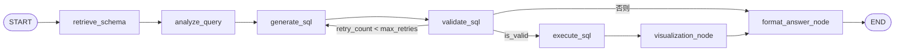

# Text2SQL 实现说明

本文描述 GustoBot 中 **自然语言 → 只读 SQL → MySQL 执行 → 可视化建议 → Markdown 答复** 的 LangGraph 流水线：代码位置、节点顺序、数据与连接方式、在主智能体中的挂载点，以及安全与验证方式。

---

## 0. 初学者导读

### 0.1 本文档适合谁

- 需要**改 Text2SQL 行为**（提示词、校验、连接、重试）的开发者。  
- 需要**排查**「为什么没进 Text2SQL」「为什么报图库连不上」「SQL 不执行」的运维与联调人员。

### 0.2 Text2SQL 与图谱 / 向量检索的区别（简要）

| 能力 | 典型问题 | 数据形态 | 文档入口 |
|------|----------|----------|----------|
| **Text2SQL**（本文） | 统计、排名、聚合、表结构相关问数 | 关系型表（MySQL），结构化执行 | 本文 |
| **GraphRAG / Cypher** | 实体关系、路径、推荐链 | Neo4j 图 | [RAG.md](RAG.md) 等 |
| **向量检索** | 语义相似文档、菜谱描述 | Milvus 等 | [向量知识库.md](向量知识库.md) |

路由上：统计类问句常经 **`text2sql-query`** 进入本流水线；与 **`graphrag-query`** 共用 `create_research_plan` 入口，具体由 `Router` 与启发式决定，见 [智能体路由速查.md](智能体路由速查.md)。

### 0.3 实现要点（一眼读完）

1. **工作流组装**在 `gustobot/application/agents/text2sql/workflow.py`。  
2. **节点实现**在 `kg_sub_graph/.../components/text2sql/`；`text2sql/components/__init__.py` 仅为兼容再导出。  
3. **Schema** 来自 **MySQL `INFORMATION_SCHEMA`**，不再依赖 Neo4j 中的表元数据图。  
4. **工具包装** `text2sql_tool.py` 仍要求 **Neo4j 可连接**（历史门禁）；且需 **`OPENAI_API_KEY`**，否则直接返回友好错误，不跑工作流。  
5. **SQL 执行**使用 **`settings.DATABASE_URL`**（见下文）。

---

## 1. 在系统中的位置

| 环节 | 说明 |
|------|------|
| 主图路由 | `Router.type == "text2sql-query"` 时进入 **`create_research_plan`**（与 `graphrag-query` 共用入口），见 `lg_builder.py`。 |
| 启发式兜底 | `_heuristic_router` 对「统计、多少、总数、数量、排名」等关键词倾向 `text2sql-query`。 |
| 子图内工具 | 多工具工作流中 **`text2sql_query`** 节点由 `create_text2sql_tool_node` 封装，见 `kg_sub_graph/.../text2cypher/text2sql_tool.py`。 |
| 工具选择 | `tool_selection` 在 `route_type == "text2sql-query"` 或问句像 SQL 场景时可直接路由到 `text2sql_query`，见 `components/tool_selection/node.py`。 |

用户通过 **统一聊天 API** 提问时，不直接调用 Text2SQL 工作流，而是由主图编排后进入上述链路。

---

## 2. 代码与目录结构

### 2.1 工作流组装（对外工厂）

- **`gustobot/application/agents/text2sql/workflow.py`**  
  - `create_text2sql_workflow(llm, neo4j_graph, db_type=..., connection_string=..., max_retries=...)`  
  - 定义节点与边：`retrieve_schema` → `analyze_query` → `generate_sql` → `validate_sql` →（条件）→ `execute_sql` → `visualization_node` → `format_answer_node` → `END`。  
  - 文件头注释仍写「Schema retrieval (Neo4j)」为**历史表述**；实际 Schema 节点已从 MySQL 读取，见 `schema_retrieval/node.py`。

### 2.2 节点实现（真实逻辑所在）

**`gustobot/application/agents/kg_sub_graph/agentic_rag_agents/components/text2sql/`**

| 目录 | 职责 |
|------|------|
| `schema_retrieval/` | 从 **MySQL `INFORMATION_SCHEMA`** 拉取与问句相关的表结构；`neo4j_graph` 参数**仅为兼容旧签名，当前不使用**。 |
| `query_analysis/` | LLM 结构化分析问句（意图、涉及表列等），见 `prompts.py`。 |
| `sql_generation/` | 基于 Schema 与分析生成 SQL，`temperature` 偏低以保证稳定。 |
| `sql_validation/` | 语法与安全校验；失败时经条件边回到 `generate_sql` 重试，直至 `max_retries`。 |
| `sql_execution/` | 使用 **SQLAlchemy** 执行**只读**查询；连接串见下文。 |
| `visualization/` | 根据结果推荐图表类型（bar/line/pie 等）。 |
| `formatting/` | 汇总为 Markdown 答复，并保留 SQL、结果、可视化配置等。 |
| `domain_knowledge.py` | 表/列/关系补充描述，辅助 Schema 与生成。 |

### 2.3 兼容导入层

**`gustobot/application/agents/text2sql/components/__init__.py`** 从上述 `components/text2sql` 再导出各 `create_*_node`，保证 `workflow.py` 的 import 路径稳定。

### 2.4 状态类型

**`gustobot/application/agents/text2sql/state.py`**：`Text2SQLState`、`Text2SQLInputState`、`Text2SQLOutputState`（含 `retry_count`、`validation_errors` 聚合等）。

---

## 3. 流水线（与条件边）

### 3.1 文本示意

```
START
  → retrieve_schema（MySQL 元数据）
  → analyze_query
  → generate_sql
  → validate_sql
        ├ is_valid → execute_sql → visualization_node → format_answer_node → END
        ├ 未通过且 retry_count < max_retries → generate_sql（重试）
        └ 超过重试 → format_answer_node → END
```

逻辑见 `workflow.py` 中 `_should_execute_or_retry`：`max_retries` 默认 **3**，也可由工具入参 `query_parameters.max_retries` 传入。

### 3.2 流程图（Mermaid）



---

## 4. 数据库连接与配置

### 4.1 执行目标

- **执行节点**（`sql_execution/node.py`）当前实现为：通过 **`settings.DATABASE_URL`** 连接数据库；注释标明**不再**从 `dbconnection` 表解析，`connection_id` 传入后**仍走同一默认 URL**（便于后续扩展时保留字段）。
- 默认栈中与菜谱样例一致时，多为 **MySQL**（Compose 内服务名 `mysql`，宿主机常见映射 **13306**）；本地 `.env` 需与运行环境一致。

### 4.2 Schema 检索

- 使用 **MySQL `INFORMATION_SCHEMA`** 与问句关键词匹配表，并结合 `domain_knowledge.py` 中的业务说明。  
- **与 Neo4j 解耦**：不再依赖 Neo4j 中的 `Table`/`Column` 元数据图。

### 4.3 工具节点：Neo4j 与 LLM（重要）

**`text2sql_tool.py`** 在实例化工作流前会：

1. **`get_neo4j_graph()`**：若 Neo4j **不可用**，直接返回「无法连接图数据库」类话术，**整条 Text2SQL 不会执行**——这是包装层的**历史门禁**，与 Schema 已从 MySQL 读取的现状并存。若需在无 Neo4j 环境跑 Text2SQL，需改该文件中的守卫逻辑（例如允许 `graph is None` 仍创建 workflow）。  
2. **`settings.OPENAI_API_KEY`**：若未配置，返回「暂时无法调用模型」类话术，**同样不进入工作流**。  

因此：**联调 Text2SQL 需要 LLM + MySQL + 当前实现下 Neo4j 可达**（即使 Schema 不读 Neo4j）。

---

## 5. 提示词文件

| 阶段 | 路径 |
|------|------|
| 查询分析 | `.../text2sql/query_analysis/prompts.py` |
| SQL 生成 | `.../text2sql/sql_generation/prompts.py` |
| 可视化 | `.../text2sql/visualization/prompts.py` |

与全局提示词工程的关系见 [提示词工程.md](提示词工程.md)（路由、多智能体提示词组织）。

---

## 6. 安全策略（摘要）

- 校验层与执行层均约束 **只读**：以 `SELECT` / `WITH` / `EXPLAIN` / `SHOW` 等开头，且语句中不得包含 `INSERT`、`UPDATE`、`DELETE`、`DROP` 等危险关键字（见 `sql_execution` 中 `_is_read_only_query` 与 validation 逻辑）。  
- 限制单次返回行数（默认 **1000**，可由状态中的 `max_rows` 传入）。  
- 拒绝多语句（分号分隔的复合提交）。

细节以 `sql_validation`、`sql_execution` 源码为准。

---

## 7. Docker 与样例数据

Compose 启动时会挂载 **`data/init_mysql.sql`**、**`data/insert_sample_data.sql`** 等初始化 MySQL，便于统计类演示。Neo4j 仍供图谱分支使用；Text2SQL **执行**不依赖 Neo4j 元数据，但 **工具节点**仍依赖 Neo4j 连接成功（见第 4.3 节）。

---

## 8. 测试与自检

```bash
python -m compileall gustobot/application/agents/text2sql ^
  gustobot/application/agents/kg_sub_graph/agentic_rag_agents/components/text2sql
```

联调示例（需后端、LLM、MySQL、且 Neo4j 可达以满足当前工具包装）：

- 自然语言：`数据库里有多少道菜`、`哪个菜系菜谱最多` 等。  
- 自动化路由：`python -m tests.test_agent_routing --single "数据库里有多少道菜"`（见 [智能体路由速查.md](智能体路由速查.md)）。

---

## 9. 常见问题与排查

| 现象 | 可能原因 | 建议 |
|------|----------|------|
| 始终走图谱/向量，不进 Text2SQL | 路由类型不是 `text2sql-query`；问句不像统计类 | 查 [智能体路由速查.md](智能体路由速查.md)；试用含「多少、总数、排名」的问句或看 `Router.type` |
| 提示无法连接图数据库 | Neo4j 未起或 `get_neo4j_graph` 失败 | 起 Neo4j 与网络；或按 §4.3 改工具层门禁 |
| 提示无法调用模型 | `OPENAI_API_KEY` 未配置 | 配置环境变量，见 [环境变量与配置说明.md](环境变量与配置说明.md) |
| SQL 为空或执行报错 | `DATABASE_URL` 错误；表不存在；非只读被拦 | 检查 `.env` 与 MySQL 是否已初始化样例数据 |
| 验证失败反复重试后结束 | 生成 SQL 不符合校验/业务表名不匹配 | 看 `validation_errors`；调整 `domain_knowledge` 或生成提示词 |
| 结果行数为 0 | 条件过严或数据确实为空 | 核对 SQL 与样例数据 |

---

## 10. 与 ChatDB / 旧文档对照

早期英文版说明中曾写「Schema 完全来自 Neo4j」「connection_id 读 dbconnection」等，已**不符合当前简化实现**。上表仍以 **多节点职责** 对照旧 AutoGen 角色，便于理解演进。

可选后续方向（仍适用）：

- SQL 自然语言解释节点、会话内多轮追问、各节点单元测试与 Mock。  
- 工具层与 Neo4j 解耦（仅保留 LLM + MySQL 即可跑 Text2SQL）。

---

## 11. 相关文档

- [智能体路由速查.md](智能体路由速查.md)  
- [agent项目架构说明.md](agent项目架构说明.md)  
- [部署指南.md](部署指南.md)  
- [环境变量与配置说明.md](环境变量与配置说明.md)  
- [RAG.md](RAG.md)（图谱与检索总览，与本文路由并列）  
- [提示词工程.md](提示词工程.md)  

---

*若 `schema_retrieval`、`sql_execution` 或 `text2sql_tool` 的门禁逻辑变更，请同步更新本文第 3、4、9 节。*
