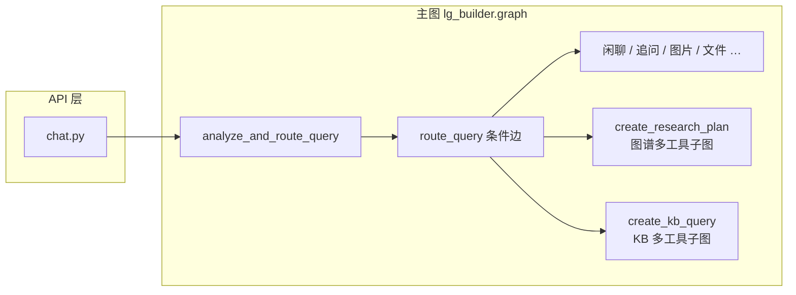

# Agent 开发项目总览

本文是 **GustoBot 后端智能体开发** 的集中说明：依赖栈、LangGraph/LangChain 用法、主图与子图结构、典型协作模式、关键节点行为、扩展与调试要点。**文首「初学者导读」** 用通俗说法解释术语、一次请求的流动、三层记忆的区别，**建议零基础读者先读**。**第 10 节「功能能力全景」** 系统归纳 **RAG、向量库、检索、Multi-Agent/Workflow、工具、记忆、Checkpoint** 等与源码的对应关系；**10.9～10.16** 专写 **重排、RAG 评估现状、Query Transformation、Function Calling、Prometheus、LangSmith、Multi-Agent 归纳与速查表**。**不展开** 前端、通用运维与 Docker 细节；全栈入口见仓库根目录 `README.md` 与 [部署指南.md](部署指南.md)。

**与其它文档的分工**：

- **本文**：Agent 专题 **主文档**（总览 + 初学者导读 + 能力全景）；与旧版「项目架构」类文档若并存，**以本文为准**。
- [智能体路由速查.md](智能体路由速查.md)：路由类型与条件边速查。
- [路由提示词与分类说明.md](路由提示词与分类说明.md)：提示词全文级说明与 L1/L2 分层。
- [环境变量与配置说明.md](环境变量与配置说明.md)：LLM、向量库等配置。
- [优化与演进建议.md](优化与演进建议.md)：可优化点、可演进功能、优先级参考（偏架构与工程）。

**统一对话入口**：`gustobot/interfaces/http/v1/chat.py` 调用 `from gustobot.application.agents.lg_builder import graph`，通过 `configurable.thread_id`（及可选 `image_path` / `file_path`）驱动主图；行为细节见 [对话与聊天说明.md](对话与聊天说明.md)。

**文档约定（阅读时请注意）**：

- **包路径**：文中 **`gustobot/...`** 均相对仓库根目录；单独写 **`lg_builder.py`** 时，默认指 **`gustobot/application/agents/lg_builder.py`**。  
- **与代码同步**：节点名、环境变量名以 **当前源码与 [环境变量与配置说明.md](环境变量与配置说明.md)** 为准；大改编排后请 **同步更新** 本文对应小节。  
- **篇幅**：全文较长，可用下表 **目录** 跳转；编辑器支持大纲侧栏时可直接折叠浏览。

---

## 目录（章节速览）

在编辑器中可用 **大纲 / 符号列表** 折叠浏览，或 **Ctrl+F 搜索 `## ` + 节号**。

| 章节 | 主要内容 |
|------|----------|
| **初学者导读** | 阅读顺序、术语表、请求流程、三层记忆、配置与 FAQ |
| **§1** | 依赖包与概念能力 |
| **§2** | StateGraph、checkpoint、路由、HTTP 调用契约、部分更新 |
| **§3** | ChatOpenAI、LCEL、结构化输出、bind_tools、tags |
| **§4** | 各节点职责、`create_research_plan` / `create_kb_query`、调试示例 |
| **§5～§7** | 图谱多工具、KB 多工具、Text2SQL 三个子系统 |
| **§8～§9** | 提示词位置、扩展调试与常见坑 |
| **§10** | 功能能力全景（RAG、向量、重排、评估、工具、记忆、Prometheus/LangSmith 等） |
| **§11～§12** | 建议阅读顺序、维护说明 |
| **附录 A/B/C** | 调试检查表、延伸阅读、关键文件路径索引 |

---

## 初学者导读：建议先读这一段

如果你刚接触 **LangGraph / LangChain / RAG**，下面内容帮你建立「心智模型」，再读后面各节会轻松很多。有经验的读者可跳过，直接从 **第 1 节** 或 **第 10 节** 开始。

### 读文档的推荐顺序

1. **本导读** → 搞清「一次请求怎么走」「名词是什么意思」。  
2. **第 2 节（LangGraph）** → 理解 **状态、节点、边、checkpoint**；这是全书的骨架。  
3. **第 4 节（主图节点）** → 知道每个节点干什么。  
4. **第 5～7 节（三个子系统）** → 深入「图谱多工具」「KB 多工具」「Text2SQL」。  
5. **第 10 节（功能能力全景）** → 把 RAG、重排、工具、记忆等横向串起来。  
6. **对照源码**：打开 `gustobot/application/agents/lg_builder.py`，用 **「节点函数名」** 在本文里搜索，建立 **文档 ↔ 代码** 映射。

### 术语速查（看到陌生词可以翻回来）

| 术语 | 通俗理解 | 在本项目里 |
|------|----------|------------|
| **Agent（智能体）** | 能根据输入 **多步决策**（调模型、调工具、再汇总）的程序，而不是「只调一次大模型」。 | 主图 + 若干 **子图** 组成的编排；不是单独一个 `while True`。 |
| **工作流 / Workflow** | 事先画好的 **步骤图**：先 A 再 B，或「满足条件走 C」。 | **`StateGraph`** 编译后的 **`graph`**；**`create_multi_tool_workflow`** 是其中一种子工作流。 |
| **节点（Node）** | 图里的 **一个步骤**，通常是一个 **异步函数** `async def xxx(state) -> dict`，返回 **要合并进状态** 的片段。 | 如 **`analyze_and_route_query`**、`create_kb_query`。 |
| **边（Edge）** | 节点之间的 **箭头**；**条件边**根据状态决定下一步去哪个节点。 | **`add_conditional_edges(..., route_query)`** 根据 **`Router.type`** 分流。 |
| **状态（State）** | 在整张图里 **传递的共享数据**；每个节点可以 **读** 也可以 **往里面写一部分**。 | 主图用 **`AgentState`**（含 **`messages`、`router`** 等）。 |
| **Checkpoint / 检查点** | 把某一时刻的 **状态存下来**，下次用同一个 **会话 id** 可以继续，而不是从零开始。 | **`MemorySaver`** + **`thread_id`**；**仅存内存**，重启服务会丢。 |
| **thread_id** | LangGraph 用来区分 **不同会话** 的字符串；和聊天产品里的 **session_id** 对齐。 | **`chat.py`** 里 **`configurable.thread_id = session_id`**。 |
| **RAG** | **检索增强生成**：先从 **知识库/数据库** 取出相关内容，再让大模型 **基于材料** 回答，减少胡编。 | 向量库 **Milvus**、**PostgreSQL**、**Neo4j**、**LightRAG** 等路径。 |
| **Embedding / 向量** | 把一句话变成 **一串数字**，语义相近的句子在数字空间也近。 | **`OpenAICompatibleEmbeddings`**；用于 **Milvus 相似检索**。 |
| **向量数据库** | 专门存 **向量** 并做 **相似度搜索** 的库。 | **Milvus**（**`vector_store.py`**）。 |
| **重排 Rerank** | 先 **多召回** 几条文档，再用 **另一个模型** 按「和问题有多相关」重新排序。 | **`Reranker`** + **`KnowledgeService.search`**。 |
| **工具 / Tool** | 模型 **不直接生成答案**，而是 **选一个动作**（查图、执行 SQL、调 LightRAG）。 | **`kg_tools_list`** 里 **Pydantic 模型** + **`bind_tools`**。 |
| **结构化输出** | 强迫模型输出 **固定 JSON 字段**（如 `type: kb-query`），方便程序 **分支**，而不是解析自由文本。 | **`with_structured_output(Router)`** 等。 |
| **Function Calling** | 厂商协议里让模型返回 **要调用的函数名和参数**；LangChain 用 **`bind_tools`** 封装。 | **`tool_selection`** 节点里选择 **Cypher / SQL / …**。 |
| **护栏 Guardrails** | 先问一句：**「这问题该不该由我们系统回答？」** 不合适则直接拒答或短路。 | **图谱子图入口**、**KB 子图入口**、主图 **`get_additional_info`** 里都有类似逻辑。 |
| **子图** | 一张 **小一点的图**，被 **主图某一节点** 整体 `ainvoke` 掉，返回 **最终一句回答**（或结构化结果）。 | **`create_multi_tool_workflow`**、**`create_kb_multi_tool_workflow`**。 |

### 一次用户提问，在系统里大致怎么走（故事版）

下面用 **「不问图片/文件」** 的典型文字对话说明；带 **`image_path`/`file_path`** 时会在路由阶段 **优先** 走图片/文件分支（见第 2 节）。

1. **浏览器 / 客户端** 向 **`POST /api/v1/chat/...`** 发：**用户一句话** + **session_id**（没有则服务端新建）。  
2. **`chat.py`** 构造 **`graph.ainvoke(input_state, config)`**：  
   - **`input_state`** 里至少有 **本轮用户消息**（`messages`）；  
   - **`config.configurable`** 里放 **`thread_id=session_id`**，让 LangGraph 知道 **这是哪一条对话线**。  
3. **主图从 `START` 进入第一个节点** **`analyze_and_route_query`**：  
   - 把 **路由系统提示词** 和用户消息（及 checkpoint 里已有的历史消息）发给 **大模型**；  
   - 模型必须用 **结构化输出** 返回 **`Router`**，里面最重要的是 **`type`**（例如 `kb-query`、`graphrag-query`）。  
   - 若模型挂了或类型非法，用 **关键词启发式** 或默认 **`kb-query`** 兜底。  
4. **`route_query`（条件边）** 读 **`Router.type`**（以及是否有附件路径），决定进入 **六个业务节点之一**：闲聊、追问、图谱研究、KB、图片、文件。  
5. **若进入 `create_research_plan` 或 `create_kb_query`**：  
   - 代码会 **再编译或复用** 一个 **子工作流**（另一张 `StateGraph`），传入 **问题文本**、**路由类型**、**历史** 等；  
   - 子图内部可能包含：**护栏 → 规划 → 选工具 → 查库 → 汇总**。  
6. **子图跑完** 通常得到 **字符串答案**，主图把它包成 **`AIMessage`** 放进 **`messages`**。  
7. **`graph.ainvoke` 返回** 给 **`chat.py`**：取 **最后一条助手消息** 作为展示内容，同时可取 **`router`**、**`sources`** 等写库或返回前端。  

**要点**：主图 **不负责** 具体怎么查 Neo4j——它只负责 **把人送到正确的「车间」**；**车间内部的流水线** 在 **子图** 里。

**结构示意图（帮助建立整体印象）**：



### 三个「记忆」层次：初学者最容易混淆

| 层次 | 它解决什么问题 | 数据存在哪 | 和「上下文的记忆」关系 |
|------|----------------|------------|------------------------|
| **LangGraph Checkpoint** | 同一 **`thread_id`** 下，**下一次 `ainvoke`** 能否看到 **上一轮留在状态里的消息**？ | **本进程内存**（`MemorySaver`） | **是**「图内部的对话状态」；**重启后端会清空**。 |
| **业务数据库里的会话消息** | 产品上要 **历史记录列表、审计、换设备还能看**？ | **MySQL/SQLite 等**（`chat_session` / `chat_message`） | **是**「产品级持久化」；**不会**把完整 **`agent_state`** 大对象塞进每条消息（体积与稳定性）。 |
| **Redis 里的缓存/历史（可选）** | 想 **加速重复问题** 或 **单独存一份 Redis 对话**？ | **Redis**（`redis_cache.py` 提供类） | **当前主聊天链路未必接入了这些类**；属于 **可插拔基础设施**。 |

初学时只需牢记：**thread_id 管 LangGraph 续跑；数据库管产品展示；两者不是同一个东西。**

### 配置从哪里读？改一个参数要动哪里？

- **全局默认值**：**`gustobot/config/settings.py`**（**`pydantic-settings`**），会从 **环境变量** 和项目根目录 **`.env`** 读入。  
- **和 Agent 强相关的变量**：LLM、Embedding、Milvus、Neo4j、Rerank、KB 阈值等，见 **[环境变量与配置说明.md](环境变量与配置说明.md)**。  
- **改路由话术**：**`lg_prompts.py`** 里的 **`ROUTER_SYSTEM_PROMPT`**；改完需 **重启后端** 才能生效。

### 初学者常见问题（FAQ）

**Q：为什么要有「子图」，主图直接写很多节点不行吗？**  
A：可以，但会 **极难维护**。子图把 **「图谱+多工具」**、**「KB 多源检索」** 各自封装，**主图只负责分流**；改 KB 逻辑时主要改 **`multi_tool.py`**，不必在 **`lg_builder`** 里拖几千行。

**Q：`Router.type` 和「工具」有什么区别？**  
A：**Router** 决定 **走哪条业务分支**（六大类）；进到图谱子图后，**工具** 决定 **这一小步用 Cypher 还是 SQL 还是 LightRAG**。是 **两层决策**。

**Q：为什么说「多 Agent」但只有一个进程？**  
A：这里的 **Multi-Agent** 指 **多个职责不同的节点/子流程**（规划、选工具、执行），不是 **多个独立微服务**。真要分布式多 Agent，要在 **API 网关层** 再编排。

**Q：我本地跑不起来图，最先检查什么？**  
A：**`LLM_API_KEY` / `OPENAI_API_KEY`** 是否配置；路由节点会校验 Key。其次看 **Neo4j、Milvus** 等是否按 [开发指南.md](开发指南.md) / [部署指南.md](部署指南.md) 起服务（取决于你测哪条分支）。

**Q：同步 `chat` 和流式 `stream` 行为一致吗？**  
A：**核心都调 `graph.ainvoke`**，但流式路径在 **持久化、元数据、TODO** 上可能与同步路径有差异；以 **[对话与聊天说明.md](对话与聊天说明.md)** 与 **[优化与演进建议.md](优化与演进建议.md)** 中「流式落库」相关条目为准。

**Q：`graph` 在哪里被 `compile`？**  
A：在 **`lg_builder.py` 模块末尾**：**`graph = builder.compile(checkpointer=checkpointer)`**；其它模块 **应 `from gustobot.application.agents.lg_builder import graph`**，避免重复编译。

---

## 1. 依赖层面的 Agent 技术栈

以根目录 **`requirements.txt`** 为准（版本随升级可能变化，以文件为准）。

| 技术 | 包名（示例） | 在本项目中的作用 |
|------|----------------|------------------|
| **LangGraph** | `langgraph` | 主图与子图：`StateGraph`、`START`/`END`、条件边、节点异步函数；子图中 **`Send`** 多路派发、**`Command`** 动态跳转。 |
| **LangGraph Checkpoint** | `langgraph-checkpoint` | 与 **`MemorySaver`** 配合，在**进程内存**中按检查点保存状态；**非持久化到磁盘**，进程重启后丢失。 |
| **LangChain Core** | `langchain-core` | `AnyMessage`、`Runnable`、`RunnableConfig`、`ChatPromptTemplate`、LCEL 链（`|`）、**`with_structured_output`**、**`bind_tools`**。 |
| **LangChain OpenAI** | `langchain-openai` | **`ChatOpenAI`**：主路由与各节点对话模型（兼容 OpenAI 协议网关与自建 base_url）。 |
| **LangChain Neo4j** | `langchain-neo4j` | **`Neo4jGraph`**：Text2SQL 拉 schema、图谱工作流、护栏提示里注入图结构等。 |
| **LangChain Community** | `langchain-community` | 部分检索/集成能力（按模块引用）。 |
| **LangChain（元包）** | `langchain` | 历史兼容入口。 |
| **Pydantic v2** | `pydantic` / `pydantic-settings` | **`Router`**、各节点结构化输出模型；`settings` 与运行环境。 |
| **OpenAI SDK** | `openai` | 底层 HTTP API（多数经 LangChain 封装）。 |
| **LightRAG** | `lightrag-hku` | 长文档 + 图式索引检索，在图谱多工具链路中作为 **`customer_tools`** 等能力接入。 |

**概念性能力**（不对应单一包名）：**Agentic RAG**（规划 → 选工具 → 检索/执行 → 汇总）、**Text2SQL / Text2Cypher**、**护栏 Guardrails**（范围判定）、**幻觉检测**（生成与依据对照）。

**测试相关**（Agent 回归）：`pytest`、`pytest-asyncio`；示例见 `tests/test_agent_routing.py`、`tests/test_chat_api.py`。

**初学者提示**：上表不必一次背下来。开发时 **最常改** 的一般是：**LangGraph（改节点/边）**、**LangChain（改模型与提示）**、**Pydantic（改 `Router` 或工具 schema）**；**LightRAG / Neo4j / Milvus** 属于 **「接好就别动，除非换数据源」** 类依赖。

---

## 2. LangGraph：在本项目中的用法

### 2.0 主图在代码里是什么（初学者向）

在 **`lg_builder.py`** 末尾附近，你会看到类似模式（具体以源码为准）：

1. **`builder = StateGraph(AgentState, input=InputState)`** —— 声明「这张图读写 **`AgentState`**，但调用者只需提供 **`InputState`** 里有的字段（通常先是 **`messages`**）」。  
2. **`builder.add_node(...)`** —— 注册节点；只传 **一个函数** 时，节点名默认等于 **函数名**（如 **`analyze_and_route_query`**）；**`create_research_plan`** 用了 **字符串别名** `"create_research_plan"`，因为函数名可能过长或与展示名不一致。  
3. **`builder.add_edge(START, "analyze_and_route_query")`** —— 规定 **入口** 必须先跑路由。  
4. **`builder.add_conditional_edges("analyze_and_route_query", route_query)`** —— **不写死** 下一节点，而是调用 **Python 函数 `route_query(state)`**，根据其 **返回值字符串** 选择下一跳。  
5. **`graph = builder.compile(checkpointer=checkpointer)`** —— **编译** 成可执行对象；**`checkpointer`** 让 **多轮** 有意义。

**为什么要 `compile`？** 未编译前只是「蓝图」；编译后才有 **`ainvoke` / `astream`** 等运行时接口。

### 2.1 状态图与状态类型

- **`StateGraph(AgentState, input=InputState)`**（`lg_builder.py`）：主图；编译后导出 **`graph`**。  
  - **`InputState`**：调用方 **最少**要提供的内容（例如只有新 **`messages`**）。  
  - **`AgentState`**：运行过程中 **累积** 的完整状态（多出 **`router`、`documents`** 等）。初学者可理解为：**输入是增量，状态是全集**。

- **`AgentState`**（`lg_states.py`）：
  - **`messages`**：使用 **`add_messages`** 归约，多轮对话中合并、按 id 更新。  
    - **归约（reducer）** 的含义：新节点返回 **`{"messages": [某条]}`** 时，不是覆盖整个列表，而是 **按 LangGraph 规则合并**（例如追加一条助手回复）。  
  - **`router`**：**`Router`** 实例，含 **`type`**（分支枚举）、**`logic`**（路由理由，会注入部分系统提示）等。  
  - **`documents`**、**`hallucination`**、**`steps`** 等：供检索结果、幻觉节点、调试轨迹使用（视路径写入）；**若某分支从不写这些字段，它们就保持默认空值**。

- **子图**常使用独立 **`TypedDict`** 或 Pydantic State（如 **`Text2SQLState`**），并用 **`input=` / `output=`** 限制对外可见字段，避免把大块中间态泄漏回主图。  
  - **为什么要单独状态类型？** 子图内部可能有 **`tasks`、`cyphers`** 等 **主图不需要** 的字段；用 **`output=OutputState`** 可以让 **`ainvoke` 的返回值** 只暴露 **`answer`** 等少数键，**调用方（`create_research_plan`）更好写**。

### 2.2 检查点与调用约定

- **`MemorySaver()`** 作为 **`checkpointer`** 传入 **`builder.compile(checkpointer=checkpointer)`**。  
  - **初学者理解**：可以把它想成 **「按会话 id 存在内存里的一小块存档」**：里面主要是 **合并后的 `messages`** 以及 **`router` 等字段**。  
  - **注意**：它和 **浏览器里的聊天记录 UI** 不是同一份数据；UI 通常读 **数据库**；checkpoint 只为 **同一次后端进程内** 连续跑图服务。

- 调用 **`graph.ainvoke(..., config={"configurable": {"thread_id": "<会话 id>"}})`** 时，同一线程内多轮共享状态；**无 thread_id 则无法正确续聊**（以 `chat.py` 实现为准）。  
  - **第一次** 某 `thread_id`：从 **干净或仅含本轮输入** 的状态开始。  
  - **第二次** 同一 `thread_id`：LangGraph 会 **加载上次的 checkpoint**，再 **叠上** 本次 `input`（例如新的用户句）。因此 **thread_id 必须稳定** 才能「像连续对话」。

- **局限**：仅内存；要跨进程/重启持久化需换检查点后端（当前仓库默认未启用）。  
  - **实操含义**：你 **重启 Docker 容器 / 重启 uvicorn** 后，同一 `session_id` 再来请求，**图可能不记得上一轮**（但 **数据库里** 可能仍有历史消息——**产品展示** 与 **图状态** 可能不一致，这是架构上的常见现象）。

### 2.3 主图的边结构（实现要点）

- **`START` → `analyze_and_route_query`**：唯一入口。
- **`add_conditional_edges("analyze_and_route_query", route_query)`**：根据 **`state.router.type`** 映射到六个业务节点之一；若 **`state.config`**（部分调用路径）里 **`configurable.image_path` / `file_path` 存在**，**优先**图片或文件节点，**覆盖** LLM 路由结果。
- 六个业务节点在当前实现中为**分支终点**（单次 `invoke` 一轮对话从路由到应答结束）；未再连回 `analyze_and_route_query`（多轮靠 **checkpoint + 新消息** 从 `START` 再入或由 API 层组织）。

### 2.4 条件边：`route_query` 与 `Router.type`

| `Router.type` | 下一节点（函数名/注册名） |
|---------------|---------------------------|
| `general-query` | `respond_to_general_query` |
| `additional-query` | `get_additional_info` |
| `graphrag-query` / `text2sql-query` | `create_research_plan`（共用入口，子图内再区分图谱 / SQL） |
| `image-query` | `create_image_query` |
| `file-query` | `create_file_query` |
| `kb-query` | `create_kb_query` |

### 2.5 主路由失败时的启发式 `_heuristic_router`

在 **LLM 调用异常** 或 **`type` 不在允许集合** 时使用（`lg_builder.py`）；合法结构化输出**不会**与启发式二次融合。

- **倾向 `text2sql-query`**（子串匹配）：`统计`、`多少`、`总数`、`数量`、`排名`。
- **倾向 `graphrag-query`**：`怎么做`、`如何做`、`做法`、`步骤`、`火候`、`食材`、`原料`、`需要什么`、`配料`、`用什么`。
- 否则若仍无合法路由，可能落到默认 **`kb-query`**（带 fallback 说明）。

### 2.6 动态边：`Send` 与 `Command`

- **`Send(node_name, payload)`**（`workflows/multi_agent/edges.py`）：把 **Planner 拆出的多个子任务** 映射到并行或多次进入 **`text2cypher`** 等节点，属于 **map-reduce** 式编排。
- **`Command(goto=Send(...))`**（`components/tool_selection/node.py`）：根据 **工具选择** 结果，**动态决定**下一跳与载荷，实现「选工具即选路」。

### 2.7 从 HTTP 到 `graph.ainvoke` 的调用细节（学习用）

统一聊天 **`process_agent_query`**（`interfaces/http/v1/chat.py`）与主图的契约如下，读代码时可逐行对照。

1. **`config`（ RunnableConfig 片段）**  
   ```python
   config = {
       "configurable": {
           "thread_id": session_id,       # 与 DB 会话 id 对齐，供 MemorySaver 区分线程
           "image_path": image_path,      # 可选；非空时 route_query 优先走图片节点（见下）
           "file_path": file_path,
           "incremental": incremental_flag,  # 文件摄入等场景
       }
   }
   ```
2. **`input_state`**（主图 **`InputState`**，只含消息）  
   ```python
   input_state = {"messages": [{"type": "human", "content": message}]}
   ```  
   LangGraph 会将字典消息转为 **`HumanMessage`**；多轮时由 checkpoint 合并历史消息（具体以 `chat` 是否每次只传一条为准——当前非流式路径多为**单条本轮用户消息**，历史在会话层由 DB 维护，与「纯 CLI 调 graph 带全历史」略有不同，学习时可打开 `chat.py` 流式/非流式分支确认）。

3. **调用**  
   `result = await graph.ainvoke(input_state, config=config)`。

4. **结果消费**  
   - 回复文本：`result["messages"][-1].content`。  
   - 路由：`result.get("router")` 为 **`Router` 或类 dict**；`chat` 用 **`router_info.get("type")` / `get("logic")`** 填入响应。  
   - 知识库来源：分支可能在 **`AIMessage.additional_kwargs["sources"]`**（如 `create_kb_query` 成功路径）；顶层还有 **`result.get("sources")`**。  
   - **持久化**：写库时 **`metadata` 会剔除 `agent_state` 键**，避免把整份图状态塞进数据库（见 `save_message`）。

### 2.8 `route_query` 与附件覆盖（实现注意）

- 代码读取 **`state.config["configurable"]`**（若存在）中的 **`image_path` / `file_path`**，**先于** `Router.type` 决定走 **`create_image_query` / `create_file_query`**。  
- 若你本地调试发现「带了路径仍未覆盖」，需确认运行时代入的 **`state` 是否挂载 `config`**（与 LangGraph 版本、是否通过 `ainvoke(..., config=)` 传入有关）；**HTTP 路径**与上述 `config` 一致时一般可用。

### 2.9 主图节点「部分更新」约定

各业务节点返回 **字典**，常见形态：

- **`{"messages": [AIMessage(...)]}`** — 追加一条助手回复（`add_messages` 合并进状态）。  
- **`{"router": Router(...)}`** — 仅路由节点写入。  
- **`create_kb_query` 成功时** 另含 **`{"sources": [...]}`**，便于 API 返回引用。

主图 **未** 将业务节点连回 **`analyze_and_route_query`**；一轮问答 = 一次从 `START` 经路由到叶节点的运行（多轮由外部再次 `ainvoke` + checkpoint）。

---

## 3. LangChain：在本项目中的用法

### 3.0 在本项目里 LangChain 主要干什么（初学者）

可以简单记三件事：

1. **封装各家大模型 API**（本项目主要是 **`ChatOpenAI`** 兼容接口），统一成 **「发消息 → 得回复」** 的用法。  
2. **提供链式组合（LCEL）**：例如 **`prompt | llm | 解析器`**，**`|`** 表示数据从左流到右；子图护栏里常见 **`guardrails_prompt | llm.with_structured_output(Model)`**。  
3. **提供消息抽象**（**`HumanMessage` / `AIMessage`** 等），与 **LangGraph 的 `messages` 列表** 天然契合。

**本项目没有** 用 LangChain 的 **AgentExecutor 经典循环** 作为主入口；**主入口是 LangGraph**，LangChain 更多作为 **「调模型的零件库」**。

### 3.1 聊天模型

- 主路径 **`ChatOpenAI`**，参数来自 **`gustobot.config.settings`**（`LLM_API_KEY`、`LLM_BASE_URL`、`LLM_MODEL` 及 `OPENAI_*` 别名）。  
  - **温度 `temperature`**：各节点可能不同（如路由 **0.7**、KB 子图 **0.3**），**越低越稳、越高越发散**；改行为时可搜索 **`ChatOpenAI(..., temperature=)`**。
- 子图工厂普遍接收 **`BaseChatModel`**，便于单测 mock 或换模型。

### 3.2 提示与 LCEL

- **`ChatPromptTemplate.from_messages([...])`** 与 **`|`**：`guardrails_prompt | llm.with_structured_output(Model)`。
- 主图部分节点使用 **字典消息列表** `[{"role":"system","content":...}] + state.messages`，与 Chat 模板等价。

### 3.3 结构化输出 `with_structured_output`

| 场景 | Pydantic 模型（示例） |
|------|------------------------|
| 主意图路由 | `Router` |
| 主图「补充信息」分支护栏 | `AdditionalGuardrailsOutput`（`end` / `proceed`） |
| 图谱子图护栏 | `GuardrailsOutput`（`end` / `planner`） |
| 任务规划 | `PlannerOutput` |
| KB 子图 | `KBGuardrailsDecision`、`KBRouteDecision` |
| 幻觉评分 | `GradeHallucinations` |
| SQL/Cypher 分析、校验、终答校验等 | 各 `components/**/models.py` |

### 3.4 工具调用 `bind_tools`

- **`tool_selection/node.py`**：**`llm.bind_tools(tool_schemas)`** → **`PydanticToolsParser(..., first_tool_only=True)`**，从 **Cypher / 预定义 Cypher / Text2SQL / LightRAG** 等 schema 中选 **一个** 工具执行当前子任务。
- 另可结合 **代码启发式**（如 `_looks_like_sql_question`）与 LLM 结果仲裁。

### 3.5 消息与流式过滤

- 节点上为 **`ChatOpenAI`** 设置 **`tags`**（如 **`router`**、**`general_query`**、**`hallucinations`**），便于 **`astream_events`** 时过滤非业务 token（见 [对话与聊天说明.md](对话与聊天说明.md)）。

---

## 4. 主图节点职责（开发时需对照修改）

| 节点 | 职责摘要 |
|------|----------|
| **`analyze_and_route_query`** | **`ROUTER_SYSTEM_PROMPT` + 全量 `messages`** → **`Router`**；异常或非法 type 时走 **`_heuristic_router`** 或默认 **`kb-query`**。 |
| **`respond_to_general_query`** | **`GENERAL_QUERY_SYSTEM_PROMPT`**，注入 **`router.logic`**；不调检索/图谱。 |
| **`get_additional_info`** | 先 **`GUARDRAILS_SYSTEM_PROMPT` + scope + Neo4j schema** → **`AdditionalGuardrailsOutput`**；`end` 则固定拒答；否则 **`GET_ADDITIONAL_SYSTEM_PROMPT`** 生成追问。 |
| **`create_research_plan`** | 编译并 **`ainvoke`** **`create_multi_tool_workflow`**（图谱 + Text2SQL + LightRAG 等），返回 **`AIMessage`**。 |
| **`create_kb_query`** | 编译并 **`ainvoke`** **`create_kb_multi_tool_workflow`**（postgres / milvus / 外搜等）。 |
| **`create_image_query` / `create_file_query`** | 视觉、文生图或文件摄入相关逻辑（具体以 `lg_builder` 内实现为准）。 |

另：`lg_builder` 中定义了 **`check_hallucinations`**（`CHECK_HALLUCINATIONS` + **`GradeHallucinations`**），**当前主图 `add_node` 未挂载该节点**；若要在主流程中启用幻觉检测，需自行 **`add_node` + 边** 接到合适位置。

### 4.1 `create_research_plan`：如何拼出图谱多工具子图

源码：`lg_builder.create_research_plan`。

1. **LLM**：新建 **`ChatOpenAI`**，`tags=["research_plan"]`；未配置 API Key 时抛 **`RuntimeError`**。  
2. **Neo4j**：**`get_neo4j_graph()`**，失败时 **`neo4j_graph=None`**，子图仍可能继续（取决于下游是否强依赖连接）。  
3. **Few-shot**：**`RecipeCypherRetriever()`**，用于给 Text2Cypher 提供与菜谱图 Schema 相关的示例检索。  
4. **工具 schema 列表**（**`Pydantic` 模型类**，不是实例）：从 **`kg_sub_graph/kg_tools_list.py`** 引入 **`cypher_query`、`predefined_cypher`、`microsoft_graphrag_query`（LightRAG 封装）、`text2sql_query`**，传入 **`create_multi_tool_workflow(..., tool_schemas=...)`**。  
5. **预定义 Cypher 字典**：**`predefined_cypher_dict`** 来自 **`components/predefined_cypher/cypher_dict.py`**，供高频模板命中。  
6. **业务范围文案**：函数内长字符串 **`scope_description`** 传入子图，用于护栏与工具侧范围说明。  
7. **编译**：**`create_multi_tool_workflow(..., llm_cypher_validation=True)`** 等参数控制是否做 Cypher 校验。  
8. **子图入参**（对齐 **`components/state.py` → `InputState`**）：  
   ```text
   question   ← 当前用户最后一轮文本
   data       ← 此处传 []
   history    ← 此处传 []
   route_type ← 主图 Router.type（如 graphrag-query / text2sql-query），子图可按策略分支
   ```  
9. **出参**：**`response["answer"]`** 包装为单条 **`AIMessage`** 返回。

### 4.2 `create_kb_query`：KB 子图入参、可配置项与回退

源码：`lg_builder.create_kb_query`。

1. **`RunnableConfig` → `_extract_configurable(config)`** 可覆盖（若调用方传入）：**`kb_top_k`、`kb_similarity_threshold`、`kb_filter_expr`**；未传则用 **`settings`** 默认值。  
2. **主路径**：**`ChatOpenAI`**（`temperature=0.3`，`tags=["kb_multi_tool"]`）+ **`KnowledgeService()`** + **`create_kb_multi_tool_workflow(...)`**。  
   - **`external_search_url`**：优先 **`KB_EXTERNAL_SEARCH_URL`**；若为空且配置了 **`INGEST_SERVICE_URL`**，会拼 **`{INGEST}/api/search`** 作为候选外搜地址（具体是否启用还受 **`KB_ENABLE_EXTERNAL_SEARCH`** 等约束，见 `multi_tool.py`）。  
3. **传给 KB 子图的负载**：  
   - **`question`**：最后一条用户消息全文。  
   - **`history`**：把 **`state.messages[:-1]`** 转成 **`[{"role": msg.type, "content": ...}, ...]`**，供 KB 内路由提示「最近对话」使用。  
4. **成功返回**：**`AIMessage`**，且 **`additional_kwargs["sources"] = sources`**，同时顶层 **`{"sources": sources}`**，便于 HTTP 层展示引用。  
5. **异常回退**：子工作流抛错时打 **`warning`**，回退为 **`create_knowledge_query_node`** 单次检索（**`KnowledgeQueryInputState`**：`task`、`context` 里带 `top_k` / `similarity_threshold` / `filter_expr`、`steps` 标记）。

### 4.3 本地最小调用示例（需在项目根、已配置 `.env`）

```python
import asyncio
from gustobot.application.agents.lg_builder import graph

async def main():
    out = await graph.ainvoke(
        {"messages": [{"type": "human", "content": "宫保鸡丁有什么历史典故？"}]},
        config={"configurable": {"thread_id": "debug-thread-1"}},
    )
    print(out.get("router"))
    print(out["messages"][-1].content[:500])

asyncio.run(main())
```

用于验证 **`Router.type`** 与答案是否符合预期；调试图谱/SQL 时再换问句。

---

## 5. 子系统一：图谱多工具（`create_multi_tool_workflow`）

**路径**：`kg_sub_graph/agentic_rag_agents/workflows/multi_agent/multi_tool.py`（及 **`edges.py`**）。

**典型链路**（以当前编排为准，改编排时以代码为准）：

1. **护栏 `create_guardrails_node`**（`components/guardrails/node.py`）  
   - **关键词短路**：问题命中「菜、菜谱、食材、烹饪、做法、步骤、统计、多少…」等或含问号 → **直接进入 `planner`**，跳过后续 LLM 护栏（减少延迟）。  
   - 否则 **`guardrails_prompt | llm.with_structured_output(GuardrailsOutput)`**，**`decision`** 为 **`end`** 或 **`planner`**。  
   - **特殊规则**：若模型判 **`end`** 但问题仍含领域关键词，可 **强制改为 `planner`**；LLM 失败时 **回退 `planner`**。  
   - 输出 **`next_action`**、**`summary`**（拒答话术占位）等，供边条件使用。

   **实现细节（建议对照 `guardrails/node.py` 阅读）**：  
   - 短路关键词列表为代码内 **`heuristics_keywords`**（含：菜、菜谱、食材、烹饪、做法、步骤、口味、炒、煮、炖、蒸、统计、多少、用量、营养、功效等），另用 **`"?"` / `"？"`** 辅助判断。  
   - 短路分支返回 **`{"next_action": "planner", "summary": None, "steps": ["guardrails"]}`**，与 **`GuardrailsOutput`** 模型（**`decision`: `Literal["end","planner"]`**，见 `components/guardrails/models.py`）语义一致——**下一跳名在边条件里常映射为 `planner` 节点**。  
   - 若 LLM 返回 **`decision=="end"`** 且未触发「领域关键词强制」，会设置 **`summary`** 为固定拒答模板（源码中中文短句）；若仍命中关键词则 **把 decision 改为走 planner**。

2. **Planner**：**`PLANNER_SYSTEM_PROMPT`** + `planner/prompts.py` 中的人体规则，将用户问句拆成 **`Task`** 列表（**`PlannerOutput.tasks`**）。

3. **Tool selection**：**`TOOL_SELECTION_SYSTEM_PROMPT`** + **`bind_tools`** + **`PydanticToolsParser(first_tool_only=True)`**，为每个子任务选一个工具；必要时结合 **`_looks_like_sql_question`** 等代码路径。

4. **执行**：**Text2Cypher**（生成/校验/执行）、**Text2SQL** 子组件、**`microsoft_graphrag_query`（LightRAG）** 等，见 **`components/`** 下各目录。

5. **汇总**：**`summarize` / `final_answer`** 等节点生成用户可读答案。

**子图状态类型**（`agentic_rag_agents/components/state.py`，学习时必看）：

| 类型 | 主要字段 | 用途 |
|------|-----------|------|
| **`InputState`** | `question`、`data`、`history`、`route_type?` | **`create_research_plan`** 传入的初始包 |
| **`OverallState`** | `tasks`（`add` 归约）、`next_action`、`cyphers`、`steps`、`history` 等 | 多节点读写的中枢状态 |
| **`OutputState`** | `answer` 等 | 子图对外的最终摘要（以编译时 `output=` 为准） |

**`history` 更新**：**`update_history`** 保留最近 **`SIZE=5`** 条 **`HistoryRecord`**（含问答与 Cypher 轨迹摘要），避免状态无限增长。

### 5.1 `create_multi_tool_workflow` 图结构（与 `multi_tool.py` 对照）

工厂函数 **`create_multi_tool_workflow`** 返回 **`StateGraph(...).compile()`**，状态为 **`OverallState`**，入口 **`InputState`**，出口 **`OutputState`**。

**已注册节点名**（节选）：`guardrails`、`planner`、`cypher_query`、`predefined_cypher`、`customer_tools`（LightRAG）、`text2sql_query`、`summarize`、`tool_selection`、`final_answer`。

**边与分支（学习时打开源码 148–177 行）**：

1. **`START` → `guardrails`**。  
2. **`guardrails` → 条件边 `guardrails_conditional_edge`**（`edges.py`）：根据状态里的 **`next_action`** 分流——**`planner`** 进规划；**`end`**（及兼容 **`final_answer`**）直接去 **`final_answer`** 结束支路。  
3. **`planner` → 条件边 `map_reduce_planner_to_tool_selection`**：返回 **`List[Send]`**，对每个 **`Task`** 向 **`tool_selection`** 派发一条子请求（载荷里含 **`question`、`parent_task`、`context.route_type`**），即 **多任务并行进入工具选择**。  
4. 各工具节点（**`cypher_query`** 等）执行后 **汇入 `summarize` → `final_answer` → `END`**。

**工厂参数含义（摘）**：**`llm_cypher_validation`** 控制 Cypher 是否经 LLM 校验；**`max_attempts`** / **`attempt_cypher_execution_on_final_attempt`** 控制 Text2Cypher 重试策略；**`default_to_text2cypher`** 决定在工具调用为空时是否回退到动态 Cypher 路径（与 **`tool_selection`** 行为联动）。

**`components/` 目录功能索引**（便于定位改代码）：

| 目录 | 作用 |
|------|------|
| `guardrails` | 入口范围判定（含上述关键词启发式） |
| `planner` | 子任务拆解 |
| `tool_selection` | 工具选择 + `Command`/`Send` |
| `text2cypher/*` | 生成、执行、校验、纠错 |
| `text2sql/*` | 嵌入图谱工作流内的 MySQL 问数节点 |
| `cypher_tools`、`predefined_cypher`、`customer_tools` | 各类可调用工具实现 |
| `gather_*`、`summarize`、`final_answer`、`validate_final_answer` | 聚合与终答 |
| `visualize/*` | 图表与细节生成/校验 |
| `utils` | schema 拉取拼 prompt 等 |

---

## 6. 子系统二：向量知识库多工具（`create_kb_multi_tool_workflow`）

**同文件**：`multi_tool.py` 中的 **`create_kb_multi_tool_workflow`**。

**链路概要**：

1. **护栏**：企业知识库安全范围 + **`KBGuardrailsDecision`**（`decision=end` 时带 **`summary`**）。  
2. **路由器**：**`KBRouteDecision`** — **`route`**（local / external / hybrid）、**`tools`**（`postgres` / `milvus` 组合）、**`rationale`**；默认策略多为 **PostgreSQL 优先，Milvus 长文兜底**。  
3. **检索**：调用 **`KnowledgeService`** 与配置中的 **`KB_*`、`INGEST_SERVICE_URL`** 等。  
4. **终答**：**`final_prompt`** — 强调 **仅回答菜谱文化类**，避免烹饪步骤类越界（与路由分工一致）。

### 6.1 `create_kb_multi_tool_workflow` 图结构与状态类型（`multi_tool.py`）

**状态模型（同文件内 TypedDict）**：

| 类型 | 作用 |
|------|------|
| **`KBInputState`** | 入口：**`question`**、**`history`**（`List[{"role","content"}]`） |
| **`KBWorkflowState`** | 运行中：**`guardrails_decision`、`route`、`kb_tools`、`milvus_results`、`postgres_results`、`external_results`、`answer`、`steps`、`sources`** 等 |
| **`KBOutputState`** | 出口：**`answer`、`steps`、`sources`**（编译时 `output=KBOutputState`） |

**结构化输出**：**`KBGuardrailsDecision`**（**`decision`: `proceed` \| `end`**，与提示词一致）、**`KBRouteDecision`**（**`route`**: `local` \| `external` \| `hybrid`，**`tools`**: `postgres` / `milvus` 列表）。

**边（约 889–906 行）**：

```text
START → guardrails
  → [guardrails_decision=="end"] → finalize → END
  → 否则 → kb_router
kb_router → [route=="external"] → external_search → finalize
         → 否则 → local_search → [hybrid/external 且允许外搜] → external_search → finalize
                                              → 否则 → finalize
finalize → END
```

**`local_search` 节点**：按 **`KBRouteDecision.tools`** 调 **`KnowledgeService`**（PostgreSQL / Milvus 等），**`local_edge`** 决定是否再查外部 HTTP。

---

## 7. 子系统三：独立 Text2SQL 工作流（`agents/text2sql/workflow.py`）

**`StateGraph`** 线性为主，带校验重试分支：

| 顺序 | 节点名（示例） | 作用 |
|------|----------------|------|
| 1 | `retrieve_schema` | 从 Neo4j 等拉取与问数相关的 schema 上下文 |
| 2 | `analyze_query` | **`SQLAnalysis`** 结构化分析 |
| 3 | `generate_sql` | 生成 SQL |
| 4 | `validate_sql` | 校验；失败则条件边重试 |
| 5 | `execute_sql` | 连接 **`DATABASE_URL`** 执行 |
| 6 | `visualization_node` | 可选图表建议 |
| 7 | `format_answer_node` | 自然语言格式化答案 |

详细说明见 [Text2SQL实现说明.md](Text2SQL实现说明.md)。

---

## 8. 提示词文件位置（避免改错文件）

| 范围 | 文件 |
|------|------|
| 主图 | `application/agents/lg_prompts.py` |
| 图谱通用（Planner/Cypher/工具选择/总结等） | `kg_sub_graph/prompts/kg_prompts.py` |
| 图谱护栏模板构建 | `agentic_rag_agents/components/guardrails/prompts.py`（与 `create_guardrails_prompt_template` 配合） |
| KB 子图内联 | `multi_tool.py` 中 **`guardrails_prompt` / `router_prompt` / `final_prompt`** |

路由分类细则见 [路由提示词与分类说明.md](路由提示词与分类说明.md)。

---

## 9. 扩展与调试建议

**新增主图分支类型**：

1. 在 **`lg_states.Router.type`** Literal 中增加枚举值。  
2. 更新 **`ROUTER_SYSTEM_PROMPT`** 与 **`analyze_and_route_query`** 中 **`allowed_types`**。  
3. 实现 **`route_query`** 分支并实现新 **`add_node`** 节点函数。  
4. 评估 **`_heuristic_router`** 是否需要新关键词。  
5. 更新测试与 [智能体路由速查.md](智能体路由速查.md)。

**新增图谱工具**：在 **`kg_tools_list` / `multi_tools`** 中注册 schema，并扩展 **`TOOL_SELECTION_SYSTEM_PROMPT`** 中的工具说明。

**本地调试**：**`application/agents/main.py`** — `graph.astream`、`thread_id`、历史裁剪、**`Command(resume)`** 等。

**日志**：各模块 **`get_logger(service=...)`**；路由成功日志含 **`Analyze user query type completed`**；护栏含 **`Guardrails Decision Info`**。

### 9.1 工具选择节点实现要点（`tool_selection/node.py`）

- **返回类型**：异步节点返回 **`Command[goto=Send(...)]`**，**`goto`** 为目标节点名字符串（如 **`cypher_query`、`predefined_cypher`、`customer_tools`、`text2sql_query`**），**`Send`** 的 payload 含 **`task`、`query_name`、`query_parameters`、`steps`** 等，供下游工具节点消费。  
- **可用工具集合**：**`available_tools`** 来自各 **`tool_schemas[i].model_json_schema()["title"]`**，用于判断 LLM 选的模型是否在白名单。  
- **启发式优先级（先于 LLM）**：  
  1. 若问题命中 **`DESCRIPTIVE_KEYWORDS`**（口味、特色、营养、功效、介绍、食材、材料等）→ **直接 `Command` → `customer_tools`**（GraphRAG / LightRAG 路径），见源码日志「优先使用 GraphRAG」。  
  2. 若 **`_looks_like_sql_question(question)`** 且 **`context.route_type == "text2sql-query"`** → **直接 `text2sql_query`**。  
- **LLM 路径**：**`tool_selection_chain.ainvoke({"question": ...})`**，按 **`title`** 分支到 **`predefined_cypher` / `cypher_query` / `text2sql_query` / 其它已注册 tools → `customer_tools`**。  
- **默认回退**：若 LLM 无输出且 **`default_to_text2cypher`** 为真，则 **`Command(goto=Send("cypher_query", {...}))`**；否则返回指向 **`error_tool_selection`** 的 **`Command`**（是否已在 **`create_multi_tool_workflow`** 里注册该节点，请以 **`multi_tool.py` 当前 `add_node` 列表**为准）。

### 9.2 阅读源码时的常见坑

| 现象 | 原因提示 |
|------|----------|
| **`Router` 字段拿不到** | `chat` 里 **`router_info`** 可能来自 **`dict`**；优先 **`get("type")`**，或 **`Router.model_validate`**。 |
| **附件不生效** | 确认 **`config.configurable.image_path/file_path`** 是否传入；**`route_query`** 读的是 **`state.config`**（见 2.8 节）。 |
| **子图里 `route_type` 为 None** | 检查 **`create_research_plan`** 是否传入 **`_ensure_router(...).type`**。 |
| **KB 无引用** | 成功路径看 **`AIMessage.additional_kwargs["sources"]`** 与返回 **`sources`** 字段。 |
| **护栏「全放行」或「全拒」** | 对照 **`heuristics_keywords`** 与 LLM **`GuardrailsOutput`** 是否冲突；改词表需回归测试。 |
| **工具选择落到 `error_tool_selection` 崩溃** | **`tool_selection`** 在无法选工具时会 **`Command` 到 `error_tool_selection`**；若 **`create_multi_tool_workflow` 未注册同名节点**，运行时会报错——需与 **`multi_tool.py` 实际 `add_node`** 对齐或改回退逻辑。 |

---

## 10. 功能能力全景（RAG · 向量库 · 检索 · Multi-Agent · Workflow · 工具 · 记忆 · Checkpoint）

本节按「能力」归纳实现位置与数据流，便于系统学习；**具体类名/路径以源码为准**。

### 10.1 RAG（检索增强生成）在本项目中的几种形态

| 形态 | 含义 | 典型路径 |
|------|------|----------|
| **稠密向量 RAG** | 问句 embedding → **Milvus** 近似最近邻 →（可选）**Rerank** → 片段拼进 prompt 生成答案 | **`KnowledgeService.search`**；主图 **`kb-query` → `create_kb_query`** 内走 **`create_kb_multi_tool_workflow`**，本地检索节点调 **`KnowledgeService`**。 |
| **结构化 + 向量混合（KB 子图）** | **PostgreSQL（pgvector/业务表）** 优先；无命中再 **Milvus** 长文；可再接 **HTTP 外搜** | **`multi_tool.create_kb_multi_tool_workflow`** 中 **`local_search` / `external_search` / `finalize`**；路由由 **`KBRouteDecision`** 决定 **`postgres` / `milvus` 组合**。 |
| **图谱「逻辑 RAG」** | 自然语言 → **Cypher**（或模板）→ **Neo4j** 查结构化图 → **summarize/final_answer** 转写自然语言 | **`cypher_query`、`predefined_cypher`** 节点；**`RecipeCypherRetriever`** 提供 few-shot 示例，降低幻觉 SQL。 |
| **LightRAG（第三方 GraphRAG）** | 预建索引（`kv_store_*.json`、`vdb_*.json`、实体关系图）+ **hybrid/local/global** 等模式 | 独立服务 **`application/services/lightrag_service.py`**；图谱多工具里通过 **`microsoft_graphrag_query`** → **`customer_tools`** 节点调用 **LightRAG** 库。 |
| **Text2SQL RAG** | 自然语言 → **SQL** → **MySQL**（`DATABASE_URL`）→ 结果解释 | **`text2sql_query` 工具** 与独立 **`agents/text2sql/workflow.py`**；schema 经 **Neo4j 元数据节点**等拉取（见 Text2SQL 文档）。 |
| **Agentic RAG** | **Planner 拆任务** → **每任务 Tool selection** → 多路执行 → **汇总**；非单次检索 | **`create_multi_tool_workflow`**：**guardrails → planner → `Send`×N → tool_selection → 各工具 → summarize → final_answer**。 |

**与「纯聊天」的区别**：**`general-query`** 分支不调上述检索，仅用 **`GENERAL_QUERY_SYSTEM_PROMPT`** 直接生成。

### 10.2 向量数据库、嵌入与切块

| 组件 | 说明 |
|------|------|
| **Milvus** | **`infrastructure/knowledge/vector_store.py`**：集合默认 **`recipes`**，字段含 **`embedding`、`content`、标量元数据**（`recipe_id`、`name`、`category`、`difficulty` 等）；**`metric_type`** 默认 **IP**，**`IVF_FLAT`** 索引；**`search`** 支持 **`filter_expr`**。连接参数见 **`settings.MILVUS_*`**。 |
| **嵌入** | **`infrastructure/knowledge/embeddings.py`**：`OpenAICompatibleEmbeddings`，与 **`settings.EMBEDDING_*`** 对齐；维度须与 **`EMBEDDING_DIMENSION`**、Milvus **`dimension`** 一致。 |
| **切块** | **`RecursiveCharacterTextSplitter`**，块大小/重叠由 **`KB_CHUNK_SIZE`、`KB_CHUNK_OVERLAP`**（或 `KnowledgeService` 构造参数）控制。 |
| **精排 Rerank** | **`infrastructure/knowledge/reranker.py`**：**`Reranker`** 封装多厂商 HTTP；**`RERANK_*`** 环境变量；**`KnowledgeService.search`** 内在向量召回后可做 rerank。 |

**入库主路径**：**`KnowledgeService.ingest_text` / `add_document` / `add_recipe`**：切块 → 批量 embedding → **`VectorStore.add_documents`**。

### 10.3 检索与数据源总览

```text
用户问句
  ├─ L1 主路由（Router.type）
  │
  ├─ kb-query ──► KB 子图：护栏 → KB 路由 LLM
  │                 ├─ postgres（结构化/向量，优先）
  │                 ├─ milvus（长文本兜底）
  │                 └─ external HTTP（可选，受 KB_ENABLE_EXTERNAL_SEARCH 与 URL 约束）
  │
  ├─ graphrag-query / text2sql-query ──► 图谱多工具子图
  │                 ├─ Neo4j：cypher_query / predefined_cypher
  │                 ├─ LightRAG：customer_tools（microsoft_graphrag_query）
  │                 └─ MySQL：text2sql_query（route_type 与关键词启发式）
  │
  └─ 直连 API（不经主图）：knowledge_router、lightrag_router 等 ──► 单能力检索/问答
```

**Neo4j 菜谱 QA（非 LangGraph 主路径）**：**`Neo4jQAService`**（**`recipe_kg/`**）提供 **`ask`** 等，**`knowledge_router`** 可直连；与 **Cypher 工具链** 共享图数据模型但编排不同。

**外部搜索（SerpAPI）**：**`infrastructure/tools/search.py`** 等；**`ENABLE_EXTERNAL_SEARCH`** 控制是否允许工具外搜（与 KB 外搜是不同开关）。

### 10.4 Multi-Agent、Workflow 与编排模式

| 名称 | 类型 | 要点 |
|------|------|------|
| **主图 Supervisor** | **`StateGraph`** | 单入口路由到多叶节点；**无环**（一轮一问一答型）。 |
| **图谱多工具 Workflow** | **`create_multi_tool_workflow`** | **条件边 + `map_reduce_planner_to_tool_selection`（`List[Send]`）** 实现 **多任务并行工具选择**；工具执行后 **汇入 summarize**。 |
| **KB 多工具 Workflow** | **`create_kb_multi_tool_workflow`** | **线性 + 条件边**：guardrails → kb_router → local_search →（可选）external_search → finalize。 |
| **Text2SQL Workflow** | **`agents/text2sql/workflow.py`** | **顺序节点 + `validate_sql` 条件重试**；**`input`/`output` State 分离**。 |
| **单智能体变体** | **`workflows/single_agent/`** | 如 **text2cypher**、可视化辅助等，用于较窄场景。 |

**「Multi-Agent」在本仓库的含义**：多为 **单进程内多节点协作**（Planner、Tool、Summarize），而非多个独立进程 Agent；**并行**主要靠 **`Send`** 对 **`tool_selection`** 的多路派发。

### 10.5 工具（Tools）的定义与使用方式

1. **Schema**：**`kg_sub_graph/kg_tools_list.py`** 中为每个工具定义 **`class Xxx(BaseModel)`**，**`Field(description=...)`** 即给 LLM 看的说明；**`model_json_schema()["title"]`** 用作 **`bind_tools` 白名单**中的工具名。  
2. **注册到子图**：**`create_research_plan`** 把 **`[cypher_query, predefined_cypher, microsoft_graphrag_query, text2sql_query]`** 传入 **`create_multi_tool_workflow(..., tool_schemas=...)`**。  
3. **调用链**：**`create_tool_selection_node`** 内 **`llm.bind_tools(tool_schemas)`** + **`PydanticToolsParser(first_tool_only=True)`**；再结合 **关键词启发式** 直接 **`Command`→某节点**，跳过 LLM。  
4. **执行**：各 **`components/cypher_tools`**、**`predefined_cypher`**、**`customer_tools`**、**`text2sql`** 节点把 **Pydantic 参数** 转为 **Neo4j / LightRAG / MySQL** 调用。  
5. **与 LangChain Tool 的区别**：这里主要是 **Pydantic 模型 + bind_tools**，不是 **`@tool` 装饰器**；语义等价「结构化工具调用」。

### 10.6 记忆（Memory）分层：不要混淆三层

| 层次 | 机制 | 持久化 | 存什么 |
|------|------|--------|--------|
| **A. LangGraph Checkpoint** | **`MemorySaver` + `thread_id`** | **仅当前进程内存**；重启丢 | **`AgentState`**（含 **`messages` 归约结果**、**`router`** 等）；用于 **同线程多轮** 连续 `ainvoke`。 |
| **B. 业务会话库（主聊天）** | **`interfaces/http/v1/chat.py` + SQLAlchemy** | **数据库持久** | **`chat_session` / `chat_message`**；保存用户与助手文本、**`route` 元数据**；**刻意不存完整 `agent_state`**（过大且不稳定）。 |
| **C. Redis（可选基础设施）** | **`RedisSemanticCache` / `RedisConversationHistory`**（**`application/services/redis_cache.py`**） | Redis | **语义缓存**（embedding 相似命中）、**列表式会话历史**；**当前主聊天路径未必接入**，属可复用组件；**TTL/条数** 对应 **`CONVERSATION_HISTORY_*` / `REDIS_CACHE_*`**。 |

**KB 子图里的 `history`**：来自 **`state.messages[:-1]`** 转成 **`{role, content}`**，仅用于 **KB 路由提示**，**不是** LangGraph checkpoint 的替代品。

**子图 `OverallState.history`（`HistoryRecord`）**：**`update_history`** 保留有限条 **问答+Cypher 轨迹**，服务 **图谱多跳上下文**，与主会话 DB **独立**。

### 10.7 Checkpoint 与 `thread_id`（深入）

- **包**：**`langgraph-checkpoint`**；实现类 **`MemorySaver`**（**`langgraph.checkpoint.memory`**）。  
- **编译**：**`builder.compile(checkpointer=checkpointer)`**。  
- **键**：**`config["configurable"]["thread_id"]`** 必须稳定，**HTTP 层用 `session_id`** 与之对齐。  
- **语义**：同一 **`thread_id`** 的多次 **`ainvoke`** 会 **合并状态**（如 **`add_messages` 追加**）；**新会话**应 **新 thread_id**。  
- **局限**：**无跨进程共享**；**水平扩展多副本** 时每个实例内存独立，需换 **PostgresSaver / RedisSaver** 等（本仓库默认未配）。  
- **其它 `configurable`**：**`image_path`、`file_path`、`incremental`**、以及 KB 相关的 **`kb_top_k`** 等（见 **`_extract_configurable`**）。

### 10.8 幻觉检测与质量节点（可选）

- **`check_hallucinations`**（**`lg_builder`**）：**`CHECK_HALLUCINATIONS`** + **`GradeHallucinations`**；**主图未默认挂载**。  
- **`validate_final_answer`**（子图组件）：对终答做校验。  
- **Cypher/SQL 校验节点**：生成后执行前审计，失败进入重试或纠错路径。

### 10.9 重排（Rerank）——完整实现说明

本项目 **已实现** 检索后重排，核心在 **`infrastructure/knowledge/reranker.py`** 与 **`KnowledgeService.search`**，KB 多工具里对 **PostgreSQL 结果** 另有单独重排分支。

**1. 配置（`settings` / 环境变量）**

| 变量 | 作用 |
|------|------|
| **`RERANK_ENABLED`** | 总开关；为假或缺少 provider/api_key 时 **`Reranker.enabled=False`**，调用 **`rerank`** 安全退化为截断原列表。 |
| **`RERANK_PROVIDER`** | **`custom`**（自建 HTTP）、**`cohere`**、**`jina`**、**`voyage`** 等。 |
| **`RERANK_BASE_URL` / `RERANK_ENDPOINT` / `RERANK_MODEL` / `RERANK_API_KEY`** | 服务端点与鉴权；**`custom`** 走 **`_custom_rerank`**（兼容类 DashScope/BGE HTTP）。 |
| **`RERANK_MAX_CANDIDATES`** | 启用重排时 **向量召回条数**（先多召再精排）。 |
| **`RERANK_TOP_N`** | 精排后保留条数相关默认。 |
| **`RERANK_TIMEOUT`** | 请求超时。 |
| **`KB_RERANK_SCORE_THRESHOLD` / `KB_POSTGRES_RERANK_THRESHOLD`** | 向量结果 / PG 路径上 **`rerank_score`** 过滤阈值（见 **`KnowledgeService`** 与 **`multi_tool.py`**）。 |

**2. `KnowledgeService.search` 流水线（Milvus 路径）**

1. 计算 **`recall_k`**：若 **`reranker.enabled`**，**`recall_k = RERANK_MAX_CANDIDATES`**，否则为 **`top_k`**。  
2. **`embed_query`** → **`vector_store.search`**。  
3. 可选按向量 **`score`** 与 **`similarity_threshold`** 过滤。  
4. 若 **`reranker.enabled`**：**`await reranker.rerank(query, candidates, top_k)`**，文档带 **`rerank_score`**。  
5. 再按 **`KB_RERANK_SCORE_THRESHOLD`** 等规则截断（见方法内分支）。

**3. KB 子图内 PostgreSQL 路径（`multi_tool.py`）**

- 当存在 **`postgres_results`** 且 **`knowledge_service.reranker.enabled`** 时，对 PG 结果再 **`rerank`**，并按 **`KB_POSTGRES_RERANK_THRESHOLD`** 过滤。  
- **`filter_by_similarity`** 与是否启用 rerank 组合时行为不同（源码注释已说明）。

**4. 未实现部分**

- **重排模型训练/离线评估**：仓库内无独立 **rerank 效果离线评测** 脚本；效果依赖线上 **`loguru`** 日志与业务反馈。

---

### 10.10 RAG 评估体系 — 本项目现状

**结论**：**未建立** 类似 **RAGAS、DeepEval、固定黄金集自动打分** 的完整「RAG 评估体系」；仅有 **若干 LLM/规则型质量节点**，适合作为 **质量门控**，不适合等同 **科研级 RAG 指标面板**。

| 能力 | 实现位置 | 说明 |
|------|----------|------|
| **生成 vs 依据一致性（二元）** | **`check_hallucinations` + `CHECK_HALLUCINATIONS` + `GradeHallucinations`** | LLM 输出 **`binary_score`**；**主图未挂载**。 |
| **终答校验** | **`components/validate_final_answer`** | 结构化输出，偏「是否可发布」而非数据集指标。 |
| **Cypher/SQL 校验** | **text2cypher / text2sql validation 节点** | **语法与安全**，不是 answer relevance。 |
| **路由/业务元数据** | **`chat.py` 存 `route` / `route_logic`** | 便于人工抽检，**非自动指标**。 |

**若需补齐「评估体系」**：可在 **`tests/`** 引入 **RAGAS** 或自建 **召回率/答案忠实度** 脚本，对 **`KnowledgeService.search`** 与最终 **`AIMessage`** 做离线对比；当前仓库 **无现成流水线**。

---

### 10.11 Query Transformation（查询变换）— 本项目现状

**结论**：**没有** 独立模块名叫 *Query Transformation*（如 HyDE、Step-back、多跳 Query Rewriter 库）。实际接近「查询变换」语义的能力如下：

| 形态 | 实现 | 说明 |
|------|------|------|
| **问题拆解（分解为子查询）** | **`Planner` + `PLANNER_SYSTEM_PROMPT`** | 将用户问句变为 **`Task[]`**，后续 **每任务一次 tool_selection**，属于 **Agentic 分解**，不是向量检索前的单一 rewrite。 |
| **意图 → 路由类型** | **`ROUTER_SYSTEM_PROMPT` + `Router`** | 将自然语言 **分类** 为 **`kb-query` / `graphrag-query` 等**，决定走哪条检索链。 |
| **KB 内路由** | **`KBRouteDecision`** | 将问题映射为 **`local/external/hybrid`** + **`tools: [postgres|milvus]`**。 |
| **NL → 可执行查询** | **Text2Cypher / Text2SQL** | 属于 **生成** 而非「同义改写」。 |
| **多查询生成提示词** | **`GENERATE_QUERIES_SYSTEM_PROMPT`**（**`lg_prompts.py`**） | 文档约定用于研究/子图侧；**`lg_builder` 仅 import，主路径未见调用**——若需「多查询扩展检索」，需在节点中 **显式接入** 该模板。 |

**未实现（若产品需要再引入）**：**HyDE**（假设文档再检索）、**同义 Query 扩展**、**多语言归一** 等独立管线。

---

### 10.12 Function Calling（函数/工具调用）— 与本项目代码的对应关系

**结论**：子图工具选择使用 **LangChain 的「绑定工具」能力**，在 OpenAI 兼容服务端通常映射为 **`tools`/`tool_calls`** 协议；**不等同于** 手写 HTTP `function_call` JSON。

| 机制 | 代码 | 说明 |
|------|------|------|
| **工具绑定** | **`llm.bind_tools(tool_schemas)`** | **`tool_schemas`** 为 **`Pydantic` 模型类列表**（**`kg_tools_list`**）。 |
| **解析** | **`PydanticToolsParser(..., first_tool_only=True)`** | 取 **第一条** 工具调用，映射回 **Pydantic 实例**。 |
| **执行跳转** | **`Command` + `Send(node, payload)`** | 不依赖「模型再发一轮 tool_result」，而是由 **图运行时** 派发到 **Cypher / SQL / LightRAG** 等节点。 |
| **结构化输出（非工具）** | **`with_structured_output(Router | PlannerOutput | …)`** | **JSON Schema 约束字段**，**无 tool 名**；用于路由、护栏、规划等。 |

**与 OpenAI Function Calling 文档的对应**：**`bind_tools`** 产生 **`tool_calls`** → 解析为参数 → 本项目用 **LangGraph `Command/Send`** 代替 ReAct 循环中的多轮 tool 消息（具体以 **`tool_selection/node.py`** 为准）。

---

### 10.13 指标监控（Prometheus）— 现状

- **依赖**：根目录 **`requirements.txt`** 含 **`prometheus-client`**。  
- **代码**：在 **`gustobot/`** 内 **未发现** **`prometheus_client.Counter` / `Histogram` / `generate_latest`** 等引用，**即业务尚未接入 Prometheus 指标导出**。  
- **可扩展方向**：在 **`FastAPI`** 中增加 **`/metrics`**，对 **`chat` 请求量、路由分布、子图耗时、检索错误率** 打点；当前需 **自行实现**。

---

### 10.14 链路追踪（LangSmith）— 现状

- **代码**：仓库内 **无** **`langsmith`** 依赖、**无** **`LANGCHAIN_TRACING_V2` / `LANGSMITH_API_KEY`** 等显式配置。  
- **LangChain 生态**：若使用 **`langchain-openai`** 等，可在运行环境 **自行设置** LangSmith 官方推荐的环境变量（以 LangChain 当前文档为准），**无需改业务代码**即可部分追踪；**本项目未在文档或配置模板中固化该流程**。  
- **日志替代**：大量使用 **`loguru`**（**`get_logger(service=...)`**）与节点内 **`logger.info`**，属于 **应用日志**，**不是** 分布式 trace ID 级别的 LangSmith 追踪。

---

### 10.15 Multi-Agent（多智能体）— 模式归纳与代码锚点

在 **10.4** 基础上再归纳 **「协调者 + 多工作者」** 结构：

| 角色 | 对应实现 | 行为 |
|------|----------|------|
| **协调 / 分流** | 主图 **`route_query`**、子图 **`guardrails_conditional_edge`** | 决定进入规划或直接终答。 |
| **任务拆分** | **`create_planner_node`** | **`PlannerOutput.tasks`**。 |
| **Map** | **`map_reduce_planner_to_tool_selection`**（**`edges.py`**） | **`List[Send("tool_selection", {...})]`**，**并行**子任务。 |
| **Reduce** | **`summarize` → `final_answer`** | 聚合多工具结果。 |
| **动态工具路由** | **`tool_selection`** 返回 **`Command(Send(...))`** | **单任务内** 选 **Cypher / 预置 / LightRAG / SQL**。 |

**与「多独立 Agent 进程」的区别**：本项目为 **单进程、单图内多节点**；扩展为多服务 Agent 需 **API 编排层**，当前 **未实现**。

---

### 10.16 本节能力速查（是否已实现）

| 主题 | 是否在本仓库业务代码中实现 |
|------|----------------------------|
| 重排 Rerank | **是**（**`reranker.py` + `KnowledgeService` + KB PG 路径**） |
| RAG 评估体系（RAGAS 级） | **否**（仅有零散质量节点） |
| Query Transformation（独立 HyDE 等） | **否**（有 Planner/路由等近似能力） |
| Function Calling / 工具调用 | **是**（**`bind_tools` + `Command/Send`**） |
| Prometheus 指标 | **否**（仅依赖占位） |
| LangSmith 追踪 | **否**（可依赖环境变量间接启用 LangChain 追踪，未固化） |
| Multi-Agent 编排 | **是**（LangGraph + Planner + 并行 `Send`） |

---

## 11. 建议阅读顺序（代码）

1. `lg_states.py` — `Router`、`AgentState`。  
2. `lg_builder.py` — `analyze_and_route_query`、`route_query`、**`create_research_plan` / `create_kb_query`** 内 `ainvoke`。  
3. `multi_tool.py` — **`create_multi_tool_workflow`**、**`create_kb_multi_tool_workflow`**。  
4. `components/guardrails/node.py` — 关键词短路与 LLM 护栏。  
5. `components/tool_selection/node.py` — **`bind_tools`** 与 **`Command`**。  
6. `text2sql/workflow.py` — 线性子图与条件重试。  

**专题文档**：[智能体路由速查.md](智能体路由速查.md)、[路由提示词与分类说明.md](路由提示词与分类说明.md)、[Text2SQL实现说明.md](Text2SQL实现说明.md)、[LightRAG服务指南.md](LightRAG服务指南.md)、[环境变量与配置说明.md](环境变量与配置说明.md)。

---

## 12. 维护说明

- 升级 **LangGraph / LangChain** 大版本时，重点回归：**`StateGraph` 编译参数**、**`Send`/`Command`**、**`with_structured_output`** 行为、**checkpoint** 与 **`configurable`** 传递。  
- 修改 **`guardrails`** 关键词表时，注意与主图 **`_heuristic_router`**、**`route_query`** 策略是否一致，避免「主图已放行、子图全拒」或相反。  
- 调整 **向量维度 / 集合 / Rerank 地址** 时，同步 **[环境变量与配置说明.md](环境变量与配置说明.md)** 与 **Milvus 集合重建** 流程（若有）。  
- **大改主图节点或 `Router.type`**：同步 [智能体路由速查.md](智能体路由速查.md)、[路由提示词与分类说明.md](路由提示词与分类说明.md)，并视情况更新 **[优化与演进建议.md](优化与演进建议.md)** 中的风险项。  
- **本文自身**：增删章节后更新文首 **目录表** 与 **附录 C.3**；避免引用已删除的 `docs` 文件名。  

---

## 附录 A：初学者调试检查表（按顺序勾）

1. **`.env`**：至少配置 **`LLM_API_KEY`**（或 **`OPENAI_API_KEY`**）、**`LLM_BASE_URL`**（若用网关）、**`LLM_MODEL`**。  
2. **路由是否工作**：看日志 **`Analyze user query type completed`**，确认 **`Router.type`** 是否符合预期（对照 [智能体路由速查.md](智能体路由速查.md)）。  
3. **分支是否进对**：**`kb-query`** 看 **`------execute KB multi-tool query------`**；**`graphrag-query`** 看 **`create_research_plan` / `research_plan`** 相关日志。  
4. **依赖服务**：测图谱则 **Neo4j** 可连；测向量则 **Milvus** 与 **Embedding** 配置一致；测 PG 则 **ingest/kb_ingest** 与 URL 是否正确（见 [环境变量与配置说明.md](环境变量与配置说明.md)）。  
5. **混淆排查**：若「数据库里有历史但图里像失忆」，回到 **初学者导读 → 三个记忆层次** 对照 **checkpoint 是否因重启清空**。  

---

## 附录 B：进一步阅读（官方与项目内）

| 方向 | 建议 |
|------|------|
| LangGraph 概念 | LangGraph 官方文档：**StateGraph、checkpoint、Send/Command**（英文为主）。 |
| LangChain 消息与工具 | LangChain 文档：**Chat models、`.bind_tools()`、structured output**。 |
| 本项目路由与提示 | [路由提示词与分类说明.md](路由提示词与分类说明.md)、[智能体路由速查.md](智能体路由速查.md)。 |
| 部署与端口 | [部署指南.md](部署指南.md)、[快速开始.md](快速开始.md)。 |
| 对话 API 与流式 | [对话与聊天说明.md](对话与聊天说明.md)。 |
| 本地开发命令 | [开发指南.md](开发指南.md)。 |
| 数据与爬虫（非 Agent 核心但常配合知识库） | [爬虫与批量导入指南.md](爬虫与批量导入指南.md)。 |
| 架构优化与排期参考 | [优化与演进建议.md](优化与演进建议.md)。 |

---

## 附录 C：关键源码与文档路径索引

便于 **Ctrl+P / 全局搜索** 时对照；**文件名以仓库为准**。

### C.1 Agent 编排（必读）

| 路径 | 说明 |
|------|------|
| `gustobot/application/agents/lg_builder.py` | 主图编译、`analyze_and_route_query`、`route_query`、各业务节点 |
| `gustobot/application/agents/lg_states.py` | `Router`、`AgentState`、`GradeHallucinations` |
| `gustobot/application/agents/lg_prompts.py` | 主图系统提示（路由、通用问答、护栏、RAG、图片等） |
| `gustobot/application/agents/kg_sub_graph/agentic_rag_agents/workflows/multi_agent/multi_tool.py` | `create_multi_tool_workflow`、`create_kb_multi_tool_workflow` |
| `gustobot/application/agents/kg_sub_graph/agentic_rag_agents/workflows/multi_agent/edges.py` | 条件边、`Send` 派发 |
| `gustobot/application/agents/kg_sub_graph/kg_tools_list.py` | 工具 Schema（Pydantic） |
| `gustobot/interfaces/http/v1/chat.py` | HTTP 入口、`graph.ainvoke`、`configurable` |

### C.2 检索与基础设施（按需读）

| 路径 | 说明 |
|------|------|
| `gustobot/infrastructure/knowledge/knowledge_service.py` | 向量检索、切块、rerank 流水线 |
| `gustobot/infrastructure/knowledge/vector_store.py` | Milvus 封装 |
| `gustobot/infrastructure/knowledge/reranker.py` | 重排服务 |
| `gustobot/config/settings.py` | 全部环境变量默认值 |

### C.3 本项目 `docs/` 内文档地图

| 文档 | 用途 |
|------|------|
| **agent开发项目总览.md**（本文） | Agent 开发总览与能力全景 |
| **环境变量与配置说明.md** | `.env` 与配置项 |
| **智能体路由速查.md** / **路由提示词与分类说明.md** | 路由与提示词 |
| **Text2SQL实现说明.md** | 问数子图 |
| **LightRAG服务指南.md** | LightRAG 服务 |
| **对话与聊天说明.md** | Chat API |
| **开发指南.md** / **部署指南.md** / **快速开始.md** | 环境与本机/容器启动 |
| **优化与演进建议.md** | 可优化点与优先级 |
| **爬虫与批量导入指南.md** | 数据采集与导入 |

---

*全栈目录、Docker、上传接口与非 Agent API 见根目录 `README.md` 与 [部署指南.md](部署指南.md)。若本文章节增删，请同步更新 **目录表** 与 **附录 C.3**。*
