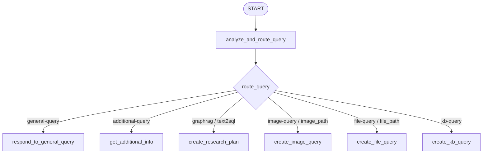
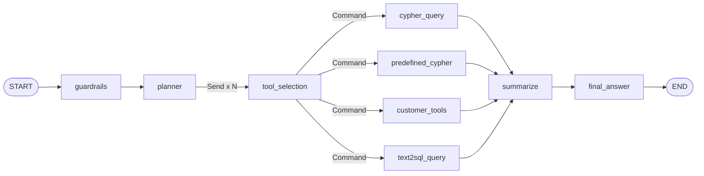

# 项目工作流（Workflow）说明

本文描述 GustoBot **对话主 LangGraph** 与各 **子工作流** 的节点、边与数据走向，便于调试「卡在哪一步」「为何进了某分支」。实现以 **`gustobot/application/agents/lg_builder.py`** 及 **`kg_sub_graph/agentic_rag_agents/workflows/`** 为准。

**相关文档**：[对话与聊天说明.md](对话与聊天说明.md)、[智能体路由速查.md](智能体路由速查.md)、[提示词工程.md](提示词工程.md)、[RAG.md](RAG.md)、[设计模式.md](设计模式.md)、[agent项目架构说明.md](agent项目架构说明.md)。

---

## 0. 初学者导读

1. **一次用户发话**：HTTP `chat` 调用 **`graph.ainvoke`**（`thread_id` = `session_id`），从主图 **`START`** 进入 **`analyze_and_route_query`**。  
2. **主图只做「分类 + 分发」**：根据 `Router.type`（及 `configurable` 里的附件路径）跳到 **六个业务节点之一**；每个节点内部可能再 **`await` 一整张子图**。  
3. **子图也是 LangGraph**：有自己的 `StateGraph`、`START/END`、条件边；对外只把 **`answer` / `messages`** 还给主图。

---

## 1. 从 HTTP 到主图

| 环节 | 位置 | 说明 |
|------|------|------|
| 路由 | `gustobot/interfaces/http/v1/chat.py` | `process_agent_query` 构造 `config`（`thread_id`、`image_path`、`file_path`、`incremental` 等） |
| 输入状态 | 同上 | `{"messages": [{"type": "human", "content": message}]}` |
| 执行 | 同上 | `await graph.ainvoke(input_state, config=config)` |
| 主图定义 | `lg_builder.py` 模块末尾 | `graph = builder.compile(checkpointer=MemorySaver())` |

---

## 2. 主工作流（`lg_builder` 编译图）

### 2.1 节点一览

主图 **不显式连接 `END` 到各叶子节点以外的边**：业务节点执行完返回 `messages` 更新后，本轮 **`ainvoke` 结束**（LangGraph 对无出边的节点视为终止）。

| 节点名 | 注册方式 | 职责摘要 |
|--------|----------|----------|
| `analyze_and_route_query` | `add_node(函数)` | L1 意图路由，写入 `state.router` |
| `respond_to_general_query` | `add_node(函数)` | 闲聊分支，仅 LLM |
| `get_additional_info` | `add_node(函数)` | 护栏 + 追问/拒答 |
| `create_research_plan` | `add_node("create_research_plan", ...)` | **图谱/问数**：内嵌 `create_multi_tool_workflow` |
| `create_image_query` | `add_node(函数)` | 图片分支 |
| `create_file_query` | `add_node(函数)` | 文件上传、Excel 外链、文本入库 + 可选 KB 问答 |
| `create_kb_query` | `add_node(函数)` | **历史文化 KB**：`create_kb_multi_tool_workflow`，失败回退 `kb_tools` |

### 2.2 边与条件路由

```1075:1077:gustobot/application/agents/lg_builder.py
# 边：START → 路由节点 → 条件边按 route_query 结果跳转
builder.add_edge(START, "analyze_and_route_query")
builder.add_conditional_edges("analyze_and_route_query", route_query)
```

### 2.3 `route_query`：`Router.type` → 下一节点

**附件优先**：若 `config.configurable` 含 **`image_path`** / **`file_path`**，**覆盖** LLM 分类，直接进入图片/文件节点。

```238:277:gustobot/application/agents/lg_builder.py
def route_query(
        state: AgentState,
) -> Literal["respond_to_general_query", "get_additional_info", "create_research_plan", "create_image_query", "create_file_query", "create_kb_query"]:
    ...
    if cfg.get("image_path"):
        ...
        return "create_image_query"
    if cfg.get("file_path"):
        ...
        return "create_file_query"

    if _type == "general-query":
        return "respond_to_general_query"
    elif _type == "additional-query":
        return "get_additional_info"
    elif _type in ("graphrag-query", "text2sql-query"):  # 图查询或结构化问数
        return "create_research_plan"
    elif _type == "image-query":
        return "create_image_query"
    elif _type == "file-query":
        return "create_file_query"
    elif _type=="kb-query":
        return "create_kb_query"
```

### 2.4 主流程示意图



---

## 3. 子工作流 A：`create_kb_query`（历史文化知识库）

### 3.1 在主图内的行为

- 取 **最后一条用户消息** 为 `question`；把 **`messages[:-1]`** 转成 `history` 列表。  
- **`configurable`** 可覆盖：`kb_top_k`、`kb_similarity_threshold`、`kb_filter_expr`。  
- 优先 **`create_kb_multi_tool_workflow`**；异常时回退 **`create_knowledge_query_node`**（仅 Milvus + LLM，无 postgres/护栏链）。

```793:876:gustobot/application/agents/lg_builder.py
async def create_kb_query(
        state: AgentState, *, config: RunnableConfig
) -> Dict[str, List[BaseMessage]]:
    """向量知识库：优先 ``create_kb_multi_tool_workflow``（LLM 选工具 + Milvus + 可选外部搜索）。
    ...
        workflow = create_kb_multi_tool_workflow(
            llm=llm,
            knowledge_service=knowledge_service,
            ...
        )
        ...
        response = await workflow.ainvoke(
            {
                "question": last_message,
                "history": history_payload,
            }
        )
        ...
        return {"messages": [ai_message], "sources": sources}
```

### 3.2 `create_kb_multi_tool_workflow` 内部图（`multi_tool.py`）

**状态**：`KBInputState` → `KBWorkflowState` → `KBOutputState`（`answer`、`steps`、`sources`）。

**节点与边**：

```889:908:gustobot/application/agents/kg_sub_graph/agentic_rag_agents/workflows/multi_agent/multi_tool.py
    graph_builder = StateGraph(
        KBWorkflowState,
        input=KBInputState,
        output=KBOutputState,
    )

    graph_builder.add_node("guardrails", guardrails)
    graph_builder.add_node("kb_router", router)
    graph_builder.add_node("local_search", local_search)
    graph_builder.add_node("external_search", external_search)
    graph_builder.add_node("finalize", finalize)

    graph_builder.add_edge(START, "guardrails")
    graph_builder.add_conditional_edges("guardrails", guardrails_router)
    graph_builder.add_conditional_edges("kb_router", router_edge)
    graph_builder.add_conditional_edges("local_search", local_edge)
    graph_builder.add_edge("external_search", "finalize")
    graph_builder.add_edge("finalize", END)
```

**语义顺序**：

1. **guardrails**：结构化判定是否继续。  
2. **guardrails_router**：`end` → **finalize**（短答）；否则 → **kb_router**。  
3. **kb_router**：LLM 输出 `KBRouteDecision`（`route` + `tools`：postgres / milvus）。  
4. **router_edge**：纯 `external` → **external_search**；否则 → **local_search**（内部按 postgres 优先再 Milvus）。  
5. **local_edge**：`hybrid`/`external` 且允许外搜 → **external_search**；否则 → **finalize**。  
6. **finalize**：拼上下文，`final_prompt` + LLM 生成 **`answer`**，收集 **sources**。

---

## 4. 子工作流 B：`create_research_plan`（图谱多工具）

### 4.1 在主图内的行为

- **`graphrag-query`** 与 **`text2sql-query`** **共用**此节点。  
- 组装 **`create_multi_tool_workflow`**（Neo4j、`RecipeCypherRetriever`、`predefined_cypher_dict`、`kg_tools_list` 等），`ainvoke` 后取 **`response["answer"]`** 封成一条 **`AIMessage`**。

### 4.2 `create_multi_tool_workflow` 拓扑（静态边 + 动态 Command）

**节点**：`guardrails`、`planner`、`tool_selection`、`cypher_query`、`predefined_cypher`、`customer_tools`（LightRAG）、`text2sql_query`、`summarize`、`final_answer`。

**静态边**（摘自 `multi_tool.py`）：

```159:177:gustobot/application/agents/kg_sub_graph/agentic_rag_agents/workflows/multi_agent/multi_tool.py
    main_graph_builder.add_edge(START, "guardrails")
    main_graph_builder.add_conditional_edges(
        "guardrails",
        guardrails_conditional_edge,
    )
    main_graph_builder.add_conditional_edges(
        "planner",
        map_reduce_planner_to_tool_selection,
        ["tool_selection"],
    )

    main_graph_builder.add_edge("cypher_query", "summarize")
    main_graph_builder.add_edge("predefined_cypher", "summarize")
    main_graph_builder.add_edge("customer_tools", "summarize")
    main_graph_builder.add_edge("text2sql_query", "summarize")
    main_graph_builder.add_edge("summarize", "final_answer")

    main_graph_builder.add_edge("final_answer", END)
```

**动态路由（要点）**：

- **planner → tool_selection**：`map_reduce_planner_to_tool_selection` 返回 **`List[Send]`**，对每个子任务派发一个 **`tool_selection` 实例**（Map）。  
- **tool_selection → 工具节点**：节点函数返回 **`Command(goto=Send("节点名", payload))`**（见 `tool_selection/node.py`），动态跳转到 **`cypher_query` / `predefined_cypher` / `customer_tools` / `text2sql_query`**（或错误分支，若图中有注册）。  
- **各工具 → summarize → final_answer → END**：多路结果在 **summarize** 合并，再 **final_answer** 生成面向用户的终答。

### 4.3 示意图（逻辑）



---

## 5. 其它独立工作流（供对照）

| 工厂函数 | 文件 | 用途 |
|----------|------|------|
| `create_text2sql_workflow` | `application/agents/text2sql/workflow.py` | Schema → 分析 → 生成 SQL → 校验（条件重试）→ 执行 → 可视化建议 → 格式化答案 |
| `create_text2cypher_agent` | `workflows/single_agent/text2cypher.py` | 单线 Text2Cypher（生成→执行等，当前边以源码为准） |
| `create_text2cypher_with_viz_and_follow_ups_workflow` | `multi_agent/text2cypher_with_viz_and_follow_ups.py` | Cypher + 可视化 + 追问变体 |

主图 **不直接编译** 上述全部；其中 **Text2SQL** 在图谱多工具里以 **`text2sql_query` 工具节点**形式嵌入（`create_text2sql_tool_node`）。

---

## 6. 检查点与会话

- **`MemorySaver`**：进程内内存检查点，按 **`thread_id`** 恢复 `messages` 等；**重启丢失**。  
- 多轮对话依赖同一 **`session_id`** 传入 `configurable.thread_id`。

---

## 7. 调试建议

1. **先看 `route`**：API 返回的 `route` / `route_logic` 对应 L1 分类。  
2. **再看日志 tag**：如 `router`、`kb_multi_tool`、`general_query`（与 `ChatOpenAI(..., tags=[...])` 一致）。  
3. **子图单独跑**：对 `create_kb_multi_tool_workflow` / `create_multi_tool_workflow` 构造最小 `input_state` 在脚本里 `ainvoke`。  
4. **附件覆盖**：带 `file_path` 仍走错分支时，查 `route_query` 是否先命中附件分支。

---

## 8. 注意事项

- **`create_multi_tool_workflow` 与 `tool_selection`** 大量依赖 **`Command`/`Send`**，与仅使用 `add_edge` 的简单图不同；升级 LangGraph 主版本时需对照迁移说明。  
- **`error_tool_selection`**：`tool_selection` 在无法确定工具且 **`default_to_text2cypher`** 为假时会 **`Command` 到 `error_tool_selection`**；若 **`create_multi_tool_workflow`** 未 **`add_node`** 注册同名节点，该路径会运行失败——以 **`multi_tool.py` 的 `add_node` 列表**为准，亦可对照 [agent开发项目总览.md](agent开发项目总览.md) 中的说明。  
- **KB 子图**的 `postgres_search_url` 默认与 **`INGEST_SERVICE_URL`** 拼接相关路径有关，摄取服务未部署时 postgres 分支会失败，可能触发主图 **Milvus-only 回退**（见 `create_kb_query` except 分支）。  
- 本文若与某分支 **`multi_tool.py` 增删节点**不一致，**以该文件与编译通过为准**。

---

*随 `lg_builder`、`multi_tool.py` 及各 `create_*_workflow` 变更更新本文。*
